<div align="center">

# SentiMind

### AI Mental Health Wellness Platform

*Agentic conversation · Voice fusion · Crisis safety · Memory · Therapeutic techniques · Outcome analytics*

SentiMind is a full-stack Final Year Project combining a Next.js frontend, FastAPI backend, LangGraph-style agent workflow, Gemini language and audio intelligence, Prisma Python ORM, Supabase PostgreSQL, structured memory, therapeutic technique selection, crisis routing, and longitudinal mood analytics.

<p>
  
  
  
  
  
  
  
  
</p>

> **Disclaimer:** SentiMind is a wellness and educational software project. It is **not** a medical device, **not** a diagnostic system, and **not** a replacement for licensed care, emergency support, or professional treatment.

</div>

---

## Table of Contents

- [Project Snapshot](#project-snapshot)
- [FYP Objectives & Implementation](#fyp-objectives--implementation)
- [Architecture Overview](#architecture-overview)
- [Runtime Flow](#runtime-flow)
- [Pre-Graph Gate](#pre-graph-gate)
- [Agent Graph](#agent-graph)
- [Node Analysis](#node-analysis)
- [Lifecycle and Outcome Tracking](#lifecycle-and-outcome-tracking)
- [Voice and Emotion Fusion](#voice-and-emotion-fusion)
- [Crisis Safety](#crisis-safety)
- [Memory and Personalization](#memory-and-personalization)
- [Dashboard Analytics](#dashboard-analytics)
- [Database Design](#database-design)
- [API Surface](#api-surface)
- [Frontend Architecture](#frontend-architecture)
- [Repository Structure](#repository-structure)
- [Environment Variables](#environment-variables)
- [Setup](#setup)
- [Running the Project](#running-the-project)
- [Validation](#validation)
- [Operational Notes](#operational-notes)
- [Credits](#credits)

## Architecture Overview

SentiMind has two orchestration layers before a user receives a reply:

- Pre-graph routing in `agent/graph.py` and `llm/llm_classifier.py`.
- The 5-node agent graph built in `build_graph()`.

The pre-graph gate decides whether the message can be handled by a fast bypass route or must enter the full therapeutic graph. The graph then performs deeper emotion, memory, technique, crisis, and response work.

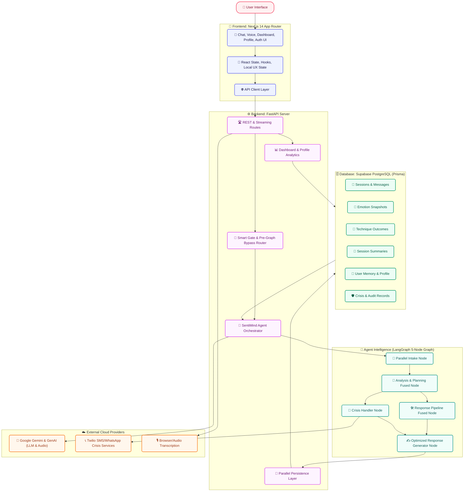

### Full Message Architecture

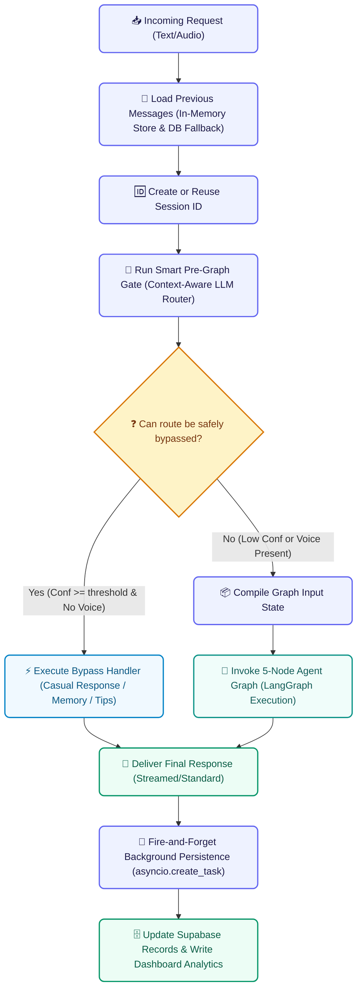

### Pre-Graph Gate

The pre-graph gate is the most important routing layer. It happens before LangGraph runs and is shared by normal chat and streaming chat. The gate is not a single check; it is a staged dispatcher that leverages parallel database loading and semantic LLM understanding to bypass or run the graph.

Main modules:

- `mental_health_wellness/src/mental_health_wellness/agent/graph.py`
- `mental_health_wellness/src/mental_health_wellness/llm/llm_classifier.py`
- `mental_health_wellness/src/mental_health_wellness/utils/turn_lifecycle.py`
- `mental_health_wellness/src/mental_health_wellness/utils/turn_signals.py`
- `mental_health_wellness/src/mental_health_wellness/utils/distress_anchor.py`

```mermaid
flowchart TD
    classDef step fill:#EEF2FF,stroke:#6366F1,stroke-width:2px,color:#1E1B4B,rx:6px,ry:6px;
    classDef parallel fill:#FDF4FF,stroke:#D946EF,stroke-width:2px,color:#701A75,rx:6px,ry:6px;
    classDef decision fill:#FEF3C7,stroke:#D97706,stroke-width:2px,color:#78350F;
    classDef bypass fill:#F0F9FF,stroke:#0284C7,stroke-width:2px,color:#075985,rx:6px,ry:6px;
    classDef graph fill:#F0FDFA,stroke:#0D9488,stroke-width:2px,color:#115E59,rx:6px,ry:6px;

    Start["📥 Latest User Message"]:::step
    LoadHistory["📜 Load Recent Message History (In-Memory / DB Fallback)"]:::step
    
    subgraph FetchParallel["🔄 Parallel Context Load (asyncio.gather)"]
        UserFacts["🧠 User Facts (Memory Extraction)"]:::parallel
        SessionSumm["📂 Session Summaries & Titles"]:::parallel
        SessionFacts["📋 Stored Session Facts & Techniques"]:::parallel
    end

    GateLLM["🚦 Smart Pipeline Gate (LLM Classifier)"]:::step
    Normalize["🔄 Normalization: Map Old Route Labels & Flags"]:::step
    FollowupProtect["🛡️ Contextual Follow-up Protection (Anchor Safeguard)"]:::step
    TurnGuess["💡 Initial Turn Type Guess (Lifecycle Stage)"]:::step
    VoiceGuard{"🎤 Voice/Audio Data Present?"}:::decision
    BypassAllowed{"❓ Bypass Conf >= Threshold?"}:::decision
    Bypass["⚡ Execute Fast Bypass Response (Chitchat, Memory, list_tips)"]:::bypass
    FullGraph["🤖 Build Graph Input State & Run 5-Node Agent Graph"]:::graph

    Start --> LoadHistory
    LoadHistory --> FetchParallel
    FetchParallel --> GateLLM
    GateLLM --> Normalize
    Normalize --> FollowupProtect
    FollowupProtect --> TurnGuess
    TurnGuess --> VoiceGuard
    VoiceGuard -- Yes (Force Graph) --> FullGraph
    VoiceGuard -- No --> BypassAllowed
    BypassAllowed -- Yes --> Bypass
    BypassAllowed -- No --> FullGraph
```

#### What The Pre-Gate Loads

The gate builds enough context to route safely without running the whole graph:

- Latest user message.
- Last few in-memory conversation turns.
- Database fallback message history when available.
- Stored user context and memory snippets.
- Current session summary, facts, and formatted session context.
- Latest recommended technique, pending technique, rejected technique, and active technique from session context.
- Previous assistant question and expected answer type.
- Prior exercise consent and solution preference.
- Voice metadata when a voice request already supplied it.

#### What The Pre-Gate Checks

The deterministic safety net checks narrow, high-precision crisis language before the LLM router:

- Explicit intent to kill oneself, end one's life, take one's life, or die.
- Statements of plan or immediate action.
- Means such as pills, knife, gun, rope, or blade with intent context.
- Recent self-harm or current self-harm.
- Passive suicidal ideation such as not wanting to exist, wanting to disappear forever, or everyone being better off without the user.

The Gemini gate then classifies the latest message using recent conversation and stored context. Active route labels are:

- `chitchat`
- `therapeutic`
- `contextual_followup`
- `technique_request`
- `technique_follow_up`
- `memory_query`
- `crisis`
- `positive_feedback`

The gate specifically checks:

- Crisis override before ordinary support.
- Whether a short answer depends on the previous assistant question.
- Whether the user is answering a duration, subject, trigger, or context question.
- Whether pronouns such as "it", "that", or "that exercise" refer to prior session context.
- Whether the user says there are no more details, which marks context complete.
- Whether a technique was rejected or did not help.
- Whether a short affirmation means technique acceptance or merely answers a context question.
- Whether "thanks" is just polite acknowledgement rather than outcome evidence.
- Whether "no thanks" after a technique offer means declined exercise consent.
- Whether the user reports a positive result after a technique.
- Whether the user asks about prior memory, previous session content, or a technique name.
- Whether the user is making a new emotional disclosure.
- Whether the user explicitly asks for a coping exercise or technique.
- Whether the message is casual small talk with no distress.
- Whether the user corrects old context or suppresses a topic.

The gate also extracts structured preference fields:

- `exercise_consent`: `unknown`, `denied`, or `allowed`.
- `solution_preference`: `unknown`, `listen_only`, `advice_allowed`, or `exercise_requested`.
- `suppression_signal`: whether the user corrected prior history.
- `suppressed_topic`: the topic/person/source the user says not to use.
- `active_issue_source`: the corrected active concern when provided.

#### Gate Normalization And Guardrails

After the LLM responds, the result is normalized and hardened:

- Old route labels are converted to current labels.
- `accept_technique` becomes `technique_follow_up` with `accept_technique` flag.
- `rejection` becomes `technique_follow_up` with rejection flags.
- `list_techniques` becomes `technique_request` with `list_techniques` flag.
- Unknown routes fall back to `therapeutic`.
- Positive outcome language forces `positive_feedback`.
- Negative exercise feedback forces `technique_follow_up`.
- Polite acknowledgement forces `chitchat` unless there is immediate technique-consent context.
- "No more details" forces `contextual_followup` and adds `context_complete`.
- Memory questions about old techniques get `technique_name_query`.
- Contextual follow-ups get lower intensity hints and mood-analysis skip flags.
- Chitchat and memory routes get near-zero intensity hints.
- Crisis gets high intensity and full pipeline.

When the gate says `therapeutic` but the message is a short answer to the last assistant question inside an active distress thread, `_protect_contextual_followup_gate()` can correct it to `contextual_followup`. This protects the original distress anchor from being overwritten by low-signal follow-up text.

#### Gate Bypass Routes

The bypass dispatcher in `_execute_gate_route()` can answer without running the full graph when the route is safe and voice emotion is not involved.

```mermaid
flowchart TD
    %% Class Definitions
    classDef step fill:#EEF2FF,stroke:#6366F1,stroke-width:2px,color:#1E1B4B,rx:6px,ry:6px;
    classDef decision fill:#FEF3C7,stroke:#D97706,stroke-width:2px,color:#78350F;
    classDef bypass fill:#F0F9FF,stroke:#0284C7,stroke-width:2px,color:#075985,rx:6px,ry:6px;
    classDef graph fill:#F0FDFA,stroke:#0D9488,stroke-width:2px,color:#115E59,rx:6px,ry:6px;
    classDef persist fill:#ECFDF5,stroke:#059669,stroke-width:2px,color:#065F46,rx:6px,ry:6px;

    GateResult["🚦 Gate Result"]:::step
    ConsentBlock{"❓ Prior listen-only or exercise refusal blocks technique?"}:::decision
    VoicePresent{"🎤 Audio or voice features present?"}:::decision
    Route{"🛣️ Route"}:::decision
    
    Chitchat["💬 chitchat: fast casual LLM response"]:::bypass
    Memory["🧠 memory_query: answer from facts or session context"]:::bypass
    TechniqueList["📋 technique_request: list techniques"]:::bypass
    TechniqueAccept["🎯 technique_follow_up accept: deliver DB technique"]:::bypass
    TechniqueReject["🙅 technique_follow_up reject: acknowledge rejection"]:::bypass
    Positive["👍 positive_feedback: acknowledge outcome & record success"]:::bypass
    Crisis["🚨 crisis: direct safety pre-screener response"]:::bypass
    
    Full["🤖 Full Graph (therapeutic route)"]:::graph
    Persist["💾 Background persist bypass turn"]:::persist

    GateResult --> ConsentBlock
    ConsentBlock -- Yes (blocked) --> Full
    ConsentBlock -- No (allowed) --> VoicePresent
    VoicePresent -- Yes (force graph) --> Full
    VoicePresent -- No --> Route
    
    Route -- chitchat --> Chitchat
    Route -- memory_query --> Memory
    Route -- list_techniques --> TechniqueList
    Route -- accept_technique --> TechniqueAccept
    Route -- reject_technique --> TechniqueReject
    Route -- positive_feedback --> Positive
    Route -- crisis --> Crisis
    Route -- therapeutic/unresolved --> Full
    
    Chitchat --> Persist
    Memory --> Persist
    TechniqueList --> Persist
    TechniqueAccept --> Persist
    TechniqueReject --> Persist
    Positive --> Persist
    Crisis --> Persist
```

Bypass is deliberately disabled for voice turns. If audio or voice features exist, the system forces the full graph so voice preprocessing and emotion fusion are not dropped.

#### Full Graph Input State

When bypass is not used, the gate builds the graph state with:

- `messages`
- `message`
- `user_id`
- `session_id`
- `gate_route`
- `gate_confidence`
- `gate_context_flags`
- `gate_emotional_register`
- `gate_intensity_hint`
- `gate_should_skip_mood_analysis`
- `gate_needs_full_pipeline`
- `prefetched_intent`
- `prefetched_user_context`
- `prefetched_session_context`
- `turn_type_guess`
- `previous_turn_context`
- session message count
- voice file path, voice features, transcription confidence, and voice feature snapshot when present

### Agent Graph Internals


The graph has no LangGraph checkpointer. It uses `_message_store` for bounded in-memory message history and `_session_context_store` for compact session continuity. This reduces serialization overhead and keeps hot path latency lower.

### Node 1: Parallel Intake

Primary module:

- `nodes/parallel_intake.py`

Inline work:

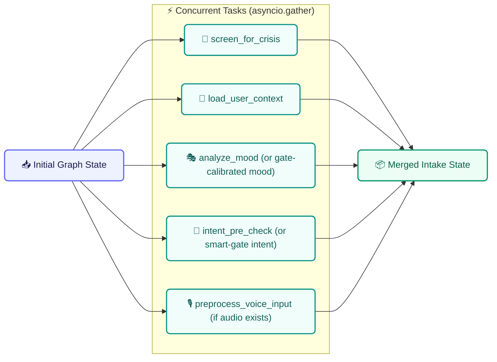

What it checks and produces:

- Skips duplicate crisis LLM when smart gate already made a confident non-crisis route.
- Runs backup crisis screen when the gate route is crisis, uncertain, or configured to duplicate crisis checks.
- Loads DB-backed user context, summaries, facts, memory, preferences, and chat history.
- Runs mood analysis unless the gate marks the turn as low-signal, contextual, memory, chitchat, positive feedback, technique follow-up, or voice-authoritative.
- Uses gate-calibrated mood for low-signal routes.
- Uses voice features as authoritative mood source when Gemini audio features are present.
- Runs intent pre-check only when the smart gate did not already provide authoritative intent.
- Runs voice preprocessing only when audio exists and voice features are not already processed.
- Preserves distress anchors so contextual replies do not lower or overwrite the true initial intensity.
- Emits emotion, sentiment, intensity, confidence, sub-emotions, symptoms, behaviors, contexts, crisis state, intent, memory context, and voice metadata.

### Node 2: Analysis And Planning

Primary module:

- `nodes/analysis_and_planning.py`

Inline subnodes:

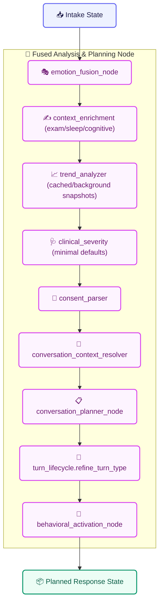

What it checks and produces:

- Fuses text and voice emotion into `fused_emotion` and `fused_intensity`.
- For therapeutic or crisis voice turns, passes authoritative Gemini audio emotion through with safety post-processing.
- For text-only turns, applies intensity normalization, neutral caps, hedge-word reduction, passive ideation checks, gate caps, and distress anchor guard.
- Detects mismatch and possible masking between text and voice signals.
- Enriches exam, study, sleep, bedtime rumination, fear-of-failure, catastrophic thought, and environment trigger context.
- Sets cognitive distortion hints such as catastrophizing when deterministic context supports it.
- Uses cached emotional trend or schedules trend refresh in the background.
- Sets clinical defaults to minimal unless optional heavier analysis is enabled.
- Parses consent, suppressed topics, corrected history, active issue source, and solution preference.
- Resolves short replies and pronouns against the last assistant question, active thread, active technique, and session context.
- Chooses conversation strategy through the planner.
- Refines lifecycle turn type from gate guess into final `INITIAL_DISCLOSURE`, `FOLLOW_UP_DISCLOSURE`, `CONTEXT_GATHERING`, `POST_RECOMMENDATION_REACTION`, or `CRISIS_DISCLOSURE`.
- Optionally adds a behavioral activation micro-action when the feature flag allows it.

Planner strategy outputs include:

- `no_action`
- `validate_only`
- `ask_question`
- `encourage_reflection`
- `reframe`
- `suggest_technique`
- `distract`

Planner phase outputs include:

- `neutral`
- `venting`
- `reflection`
- `solution`
- `recovery`

### Node 3: Response Pipeline

Primary module:

- `nodes/response_pipeline.py`

Inline subnodes:

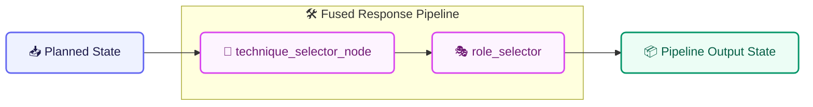

What it checks and produces:

- Checks `conversation_strategy` and `technique_readiness`.
- Honors exercise consent and listen-only preferences before selecting exercises.
- Preserves pending recommended technique until the user consents.
- Anchors short consent turns to the real underlying distress emotion.
- Searches active DB techniques semantically against emotion, sub-emotion, symptoms, behaviors, contexts, concern, and intensity.
- Filters out unsuitable or suppressed techniques.
- Returns `recommended_technique`, `recommended_techniques_by_category`, `alternative_techniques`, `technique_candidates`, and `latest_recommended_technique`.
- Selects communication role from crisis state, fused intensity, trend, and phase.

Role rules:

- Crisis detected means `crisis_support`.
- Worsening trend with intensity at or above `0.6` can escalate to `trainer`.
- Reflection phase keeps the role gentler: `coach` or `friend`.
- Intensity below `0.4` means `friend`.
- Intensity from `0.4` to below `0.7` means `coach`.
- Intensity at or above `0.7` means `trainer`.

### Node 4: Crisis Handler

Primary module:

- `nodes/crisis_handler.py`

What it checks and produces:

- Trusts crisis pre-screener level when present.
- Escalates if crisis tools were explicitly called.
- Treats medium and high risk as crisis.
- Loads saved emergency contacts only when scoped emergency-contact consent allows it.
- Builds enriched crisis details from text emotion, fused emotion, sentiment, intensity, message preview, and voice features.
- Sends WhatsApp or SMS crisis alerts through configured Twilio services when appropriate.
- Adds voice/text conflict details when voice emotion and text emotion disagree.
- Sets crisis flags and metadata for the response generator.
- Does not create the final user-facing text itself; it routes to response generation so the crisis reply is contextual and consistent.

### Node 5: Optimized Response Generator

Primary module:

- `nodes/optimized_response_generator.py`

What it checks and produces:

- Uses a fast casual prompt for `no_action`.
- Builds a full system prompt for therapeutic, crisis, memory, technique, and follow-up turns.
- Injects recent bounded history from graph state.
- Injects cross-session memory context.
- Injects response strategy, phase, trend, distortion hints, micro-action, consent preference, and suppressed topic instructions.
- Adds possible emotion mismatch guidance when voice/text mismatch or masking is detected.
- Adds rejection override when the user rejected a technique.
- Adds acceptance override when the user accepted a pending or prior technique.
- Lets the final response LLM choose from valid technique candidates when needed.
- Cleans accidental model metadata prefixes from the final reply.
- Avoids repeated empathy openings across adjacent turns.
- Marks `technique_offered_this_turn` only if the final text actually includes the selected technique.
- Emits `turn_technique_id` only when a technique was truly offered.
- Returns `final_response`, `response_task`, candidate metadata, and technique-offer flags.

### Post-Response Background Persistence

Primary module:

- `nodes/parallel_persist.py`

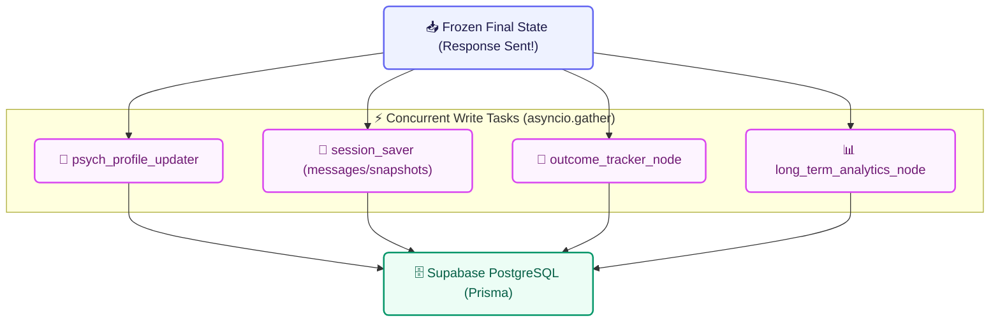

What it writes:

- User psychological profile refresh.
- User and assistant messages.
- Emotion snapshots.
- Mood logs and session fields.
- Pending or resolved technique outcomes.
- Long-term analytics snapshots and dashboard aggregates.
- Structured session handoff for the next session.

Failures in background persistence are logged and do not crash the user-facing response.

### Design Intent

SentiMind separates responsibilities into small layers:

- The frontend owns interaction quality, screens, voice controls, and user-facing dashboards.
- The API owns HTTP contracts, streaming, authentication boundaries, and request orchestration.
- The pre-graph gate protects latency and safety by separating bypassable turns from turns that need full therapeutic analysis.
- The agent graph owns deeper emotional reasoning, planning, crisis decisions, response strategy, and technique decisions.
- Persistence runs in parallel where possible so user latency stays low.
- Supabase stores both conversational history and analytic signals.
- Dashboard services transform raw records into user-facing trend views.

## Runtime Flow

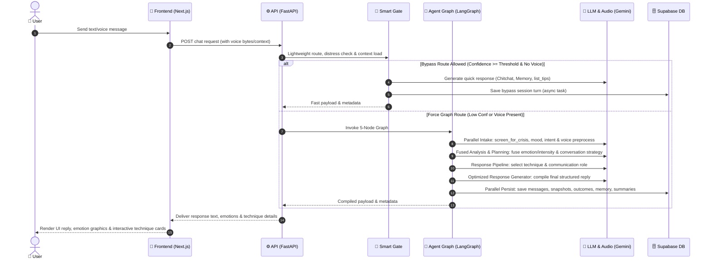

### Request Categories

- Text chat uses standard FastAPI routes and the agent graph.
- Streaming chat returns incremental model output while keeping persistence intact.
- Voice chat transcribes audio first, then routes based on transcript meaning.
- Dashboard requests bypass the agent and read analytic aggregates from Supabase.
- Crisis actions use dedicated safety routes and Twilio-backed integrations.

## Agent Graph

The agent is intentionally compact: five graph nodes with conditional routing between them. The heavy work happens inside specialized node modules, while the graph keeps orchestration readable.

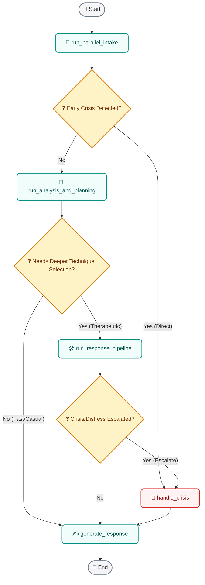

### Why This Shape Works

- Intake work runs early and in parallel.
- Crisis handling remains reachable before and after deeper analysis.
- Simple turns can skip the expensive response pipeline.
- Complex emotional turns still receive full planning, memory, technique, and analytics support.
- Response generation is the final common exit, so the assistant style remains consistent.

## Node Analysis

### 1. Parallel Intake

Primary module:

- `mental_health_wellness/src/mental_health_wellness/nodes/parallel_intake.py`

Responsibilities:

- Load context required for the current turn.
- Run early classification and extraction tasks.
- Prepare the shared agent state for analysis.
- Keep latency low by avoiding unnecessary sequential work.

Important collaborators:

- `context_loader.py`
- `intent_classifier.py`
- `crisis_detection_node.py`
- `memory_extraction_node.py`
- `smart_gate_node.py`

### 2. Analysis And Planning

Primary module:

- `mental_health_wellness/src/mental_health_wellness/nodes/analysis_and_planning.py`

Responsibilities:

- Convert raw intake signals into a response plan.
- Refine lifecycle turn type after emotion and route context are known.
- Decide whether the response needs deeper therapeutic processing.
- Prepare strategy fields consumed by the response generator.

Key outputs:

- `conversation_phase`
- `response_strategy`
- `turn_type`
- `intervention_type`
- crisis escalation state
- technique readiness state

### 3. Response Pipeline

Primary module:

- `mental_health_wellness/src/mental_health_wellness/nodes/response_pipeline.py`

Responsibilities:

- Select or suppress therapeutic techniques.
- Format active and alternative techniques.
- Track outcomes from previous technique offers.
- Select communication role (e.g. coach, friend, trainer, crisis support).

Important collaborators:

- `mental_health_wellness/src/mental_health_wellness/utils/technique_selector.py`
- `mental_health_wellness/src/mental_health_wellness/utils/role_selector.py`

### 4. Crisis Handler

`nodes/crisis_handler.py`

**Responsibilities**

- Produces crisis-safe response state
- Avoids ordinary therapeutic technique framing during emergency-like turns
- Connects crisis route metadata to API-level safety features and emergency alerts
- Enforces emergency contact verification and alert dispatch via SMS/WhatsApp
- Preserves auditability for crisis events

**Collaborators:** `services/twilio_crisis.py` · `utils/distress_anchor.py`

---

### 5. Optimized Response Generator

Primary module:

- `mental_health_wellness/src/mental_health_wellness/nodes/optimized_response_generator.py`

Responsibilities:

- Create the final assistant response.
- Respect route, phase, lifecycle, crisis, and voice-fusion guidance.
- Mark `technique_offered_this_turn` only when the final assistant message actually offers the selected technique.
- Avoid claiming the user feels differently when text and voice signals conflict.

## Lifecycle And Outcome Tracking

The lifecycle layer exists because mood analytics become noisy if every turn is treated as the same kind of emotional disclosure. A short "thanks" after a technique should not be scored like a new distress report, and a context-only answer should not distort mood-improvement graphs.

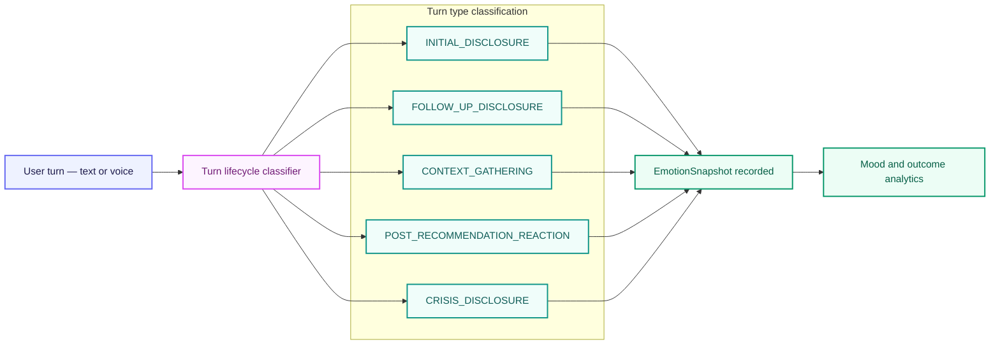

### Turn Type Reference

| Turn Type | Meaning |
|---|---|
| `INITIAL_DISCLOSURE` | First meaningful emotional disclosure in a session |
| `FOLLOW_UP_DISCLOSURE` | A later emotional update in the same session |
| `CONTEXT_GATHERING` | User is answering facts or logistics; no new mood signal |
| `POST_RECOMMENDATION_REACTION` | User is reacting after a technique or recommendation |
| `CRISIS_DISCLOSURE` | Turn contains crisis-level safety concerns |

### Outcome Flow

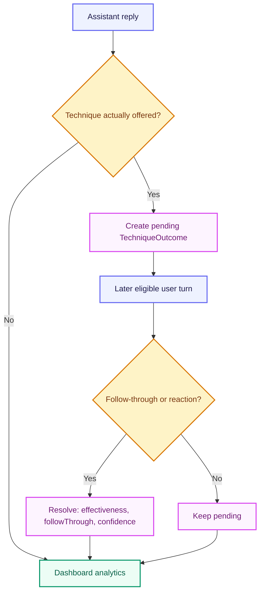

This enables meaningful questions such as:

- Did the user's intensity decrease after an actual technique offer?
- Was there enough follow-through evidence to score the technique?
- Is the dashboard comparing real disclosures instead of polite acknowledgements?
- Did the session peak improve by the final qualifying emotional snapshot?

## Voice And Emotion Fusion

Voice handling is route-aware. The system can transcribe audio and capture voice feature signals, but voice emotion is not forced into every route. The transcript drives routing first; voice features are linked into therapeutic or crisis processing when that route supports emotion fusion.

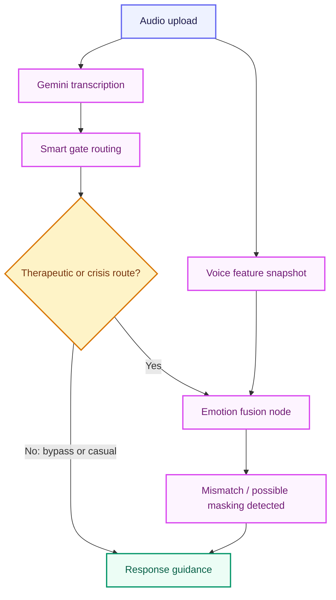

**Persisted fusion metadata:** text/voice mismatch · possible masking · fusion confidence · transcription confidence · voice feature snapshot · conversation phase · response strategy

The response prompt is instructed to acknowledge uncertainty carefully and never assert that the user feels something different from what they said.

## Crisis Safety

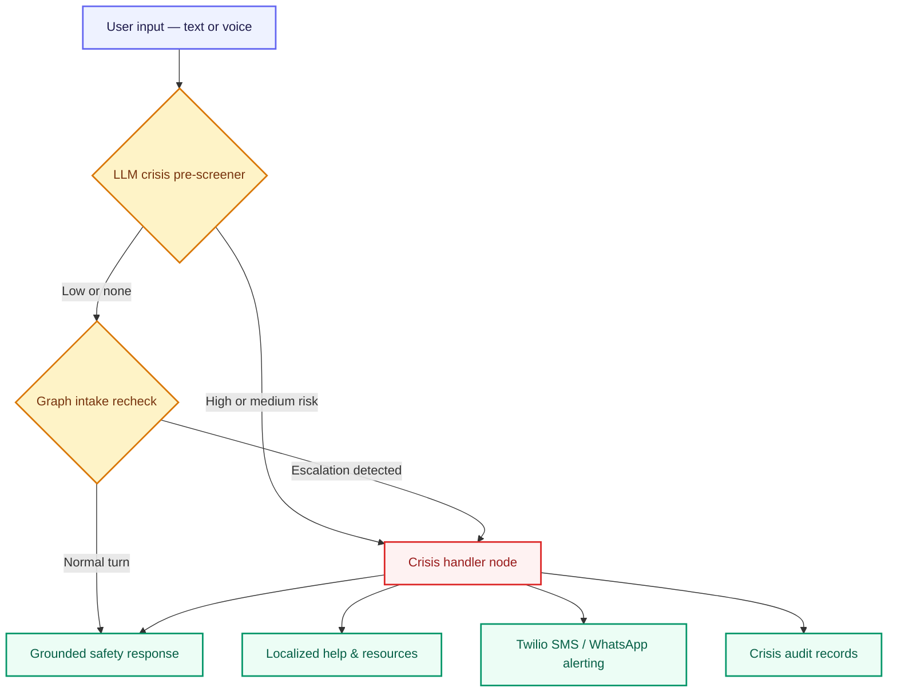

**Crisis features**

- Context-aware LLM-based crisis pre-screener in the pre-graph gate
- Parallel intake validation check inside the graph as a redundant fail-safe
- Dedicated crisis handler node managing distress peaks and emergency escalation
- Stored emergency contact integration with automatic Twilio (SMS/WhatsApp) alerts
- Secure crisis audit database logs for clinical compliance and dashboard tracking
- Safety-first grounded response templates generated by the response node

---

## Memory and Personalization

SentiMind uses several memory layers so the assistant remains continuous without treating every message as isolated.

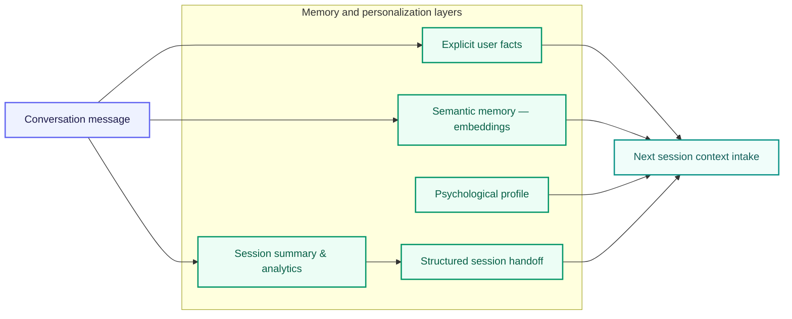

| Module | Responsibility |
|---|---|
| `memory/explicit_facts.py` | Extracts durable facts and stores them in the DB |
| `memory/semantic_memory.py` | Coordinates embedding-based search for past topic matches |
| `nodes/session_saver.py` | Updates dynamic user profile metadata, session summaries, and structured handoffs |
| `agent/graph.py` (pre-graph loader) | Injects relevant prior-session context into the smart gate |

---

## Dashboard Analytics

Dashboard analytics intentionally **ignore noisy turn types** when calculating improvement. This is where lifecycle tagging directly improves product accuracy.

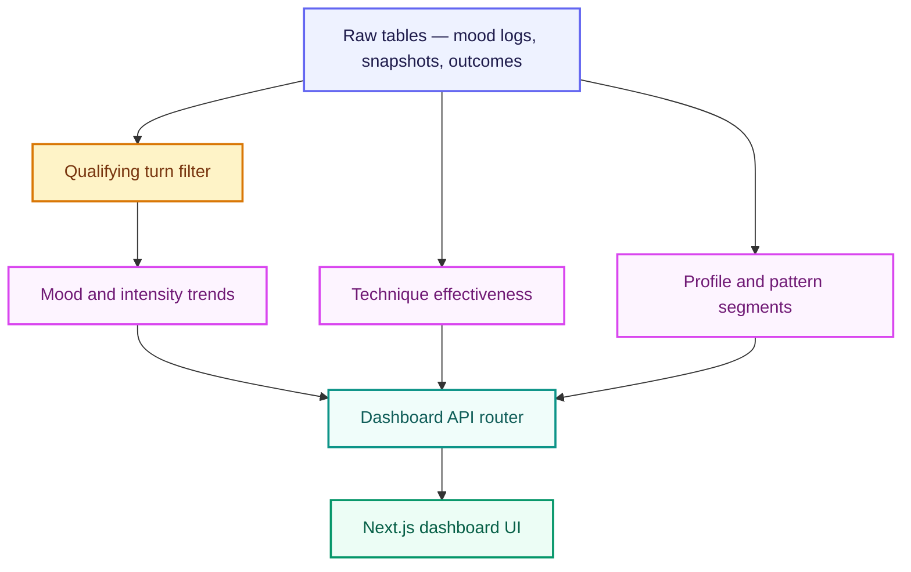

**Qualifying mood records:** `INITIAL_DISCLOSURE` · `FOLLOW_UP_DISCLOSURE` · `POST_RECOMMENDATION_REACTION` · `CRISIS_DISCLOSURE` · legacy `MoodLog` records

**Excluded from improvement-trend scoring:** `CONTEXT_GATHERING` · Short acknowledgements without outcome evidence · Assistant technique offers with no later user reaction

---

## Database Design

```mermaid
flowchart TB
    classDef user fill:#FFF1F2,stroke:#F43F5E,stroke-width:2px,color:#881337
    classDef convo fill:#EEF2FF,stroke:#6366F1,stroke-width:2px,color:#1E1B4B
    classDef wellness fill:#FDF4FF,stroke:#D946EF,stroke-width:2px,color:#701A75
    classDef memory fill:#F0FDFA,stroke:#0D9488,stroke-width:2px,color:#115E59
    classDef safety fill:#FEF2F2,stroke:#DC2626,stroke-width:2px,color:#991B1B

    User["User entity"]:::user

    subgraph Conversation["Conversation domain"]
        Session["Session — active/peak tracking"]:::convo
        Message["Message — conversational history"]:::convo
        EmotionSnapshot["EmotionSnapshot — turn-level fused emotion"]:::convo
        SessionSummary["SessionSummary — final summary, handoff"]:::convo
    end

    subgraph Wellness["Wellness and technique domain"]
        MoodLog["MoodLog — self-reports"]:::wellness
        TechniqueOutcome["TechniqueOutcome — pending/resolved"]:::wellness
        UserTechniquePreference["UserTechniquePreference — consent"]:::wellness
        PsychProfile["PsychProfile — trait tracking"]:::wellness
    end

    subgraph MemoryDomain["Memory domain"]
        UserMemory["UserMemory — long-term profile"]:::memory
        SemanticMemory["SemanticMemory — embeddings"]:::memory
        ExplicitFact["ExplicitFact — extracted facts"]:::memory
    end

    subgraph SafetyDomain["Safety and audit domain"]
        CrisisEvent["CrisisEvent — trigger logs"]:::safety
        CrisisResource["CrisisResource — help desks"]:::safety
        TrustedContact["TrustedContact — emergency verification"]:::safety
        AuditLog["AuditLog — admin/usage audits"]:::safety
    end

    User --> Session
    Session --> Message & EmotionSnapshot & SessionSummary
    User --> MoodLog & TechniqueOutcome & UserTechniquePreference & PsychProfile
    User --> UserMemory & SemanticMemory & ExplicitFact
    User --> CrisisEvent & TrustedContact & AuditLog
    CrisisEvent --> CrisisResource
```

### Schema Reference

| Table | Purpose |
|---|---|
| `Session` | Session state, mood summary, peak intensity tracking |
| `Message` | User and assistant messages plus technique-offer flags |
| `EmotionSnapshot` | Emotion, intensity, lifecycle type, fusion metadata, technique linkage |
| `TechniqueOutcome` | Pending and resolved intervention outcomes |
| `SessionSummary` | Final emotion, final intensity, turn-type counts, handoff data |
| `MoodLog` | Explicit mood logging and legacy trend support |
| Memory tables | User facts, semantic memories, profile signals |
| Crisis/audit tables | Safety and compliance-oriented records |

---

## API Surface

### Chat and Pipeline

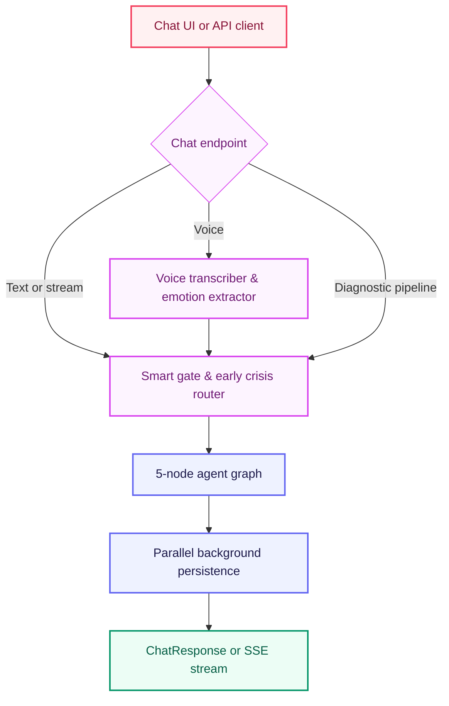

| Method | Route | Handler |
|---|---|---|
| GET | `/` | `root` |
| GET | `/health` | `health_check` |
| POST | `/api/chat` | `chat` |
| POST | `/api/chat/stream` | `chat_stream` |
| POST | `/api/chat/voice` | `chat_voice` |
| POST | `/api/pipeline/complete` | `pipeline_complete` |

### Authentication and User Bootstrap

| Method | Route | Handler |
|---|---|---|
| POST | `/api/user/create` | `create_user` |
| POST | `/api/auth/signup` | `auth_signup` |
| POST | `/api/auth/login` | `auth_login` |
| POST | `/api/user/ensure` | `ensure_user` |

### Sessions

| Method | Route | Handler |
|---|---|---|
| GET | `/api/user/{user_id}/sessions` | `get_user_sessions` |
| GET | `/api/session/{session_id}/messages` | `get_session_messages` |
| PATCH | `/api/session/{session_id}/rename` | `rename_session` |
| DELETE | `/api/session/{session_id}` | `delete_session` |
| POST | `/api/session/new` | `create_new_chat_session` |

### Dashboard and Profile

| Method | Route | Handler |
|---|---|---|
| GET | `/api/dashboard/user/{user_id}` | `get_user_dashboard` |
| GET | `/dashboard/user/{user_id}` | `dashboard_user_direct_no_api_prefix` |
| GET | `/api/dashboard/health` | `dashboard_health` |
| GET | `/api/dashboard/stats` | `get_dashboard_stats` |
| GET | `/api/user/{user_id}/stats` | `get_user_stats_legacy` |
| GET | `/api/user/{user_id}/profile` | `get_user_profile` |

### Settings, Onboarding, Consent, Data Rights

| Method | Route | Handler |
|---|---|---|
| POST | `/api/user/settings` | `save_user_settings` |
| POST | `/api/user/onboarding` | `save_onboarding` |
| DELETE | `/api/user/{user_id}` | `delete_user_account` |
| POST | `/api/user/{user_id}/consent` | `record_consent` |
| POST | `/api/user/{user_id}/consent/withdraw` | `withdraw_consent` |
| GET | `/api/user/{user_id}/data-export` | `export_user_data` |
| DELETE | `/api/user/{user_id}/data` | `delete_user_data` |

### Techniques and Wellness

| Method | Route | Handler |
|---|---|---|
| GET | `/api/wellness/tips` | `get_wellness_tips` |
| GET | `/api/techniques` | `get_techniques` |
| POST | `/api/technique/rate` | `rate_technique` |

### Crisis Router — `/api/crisis`


| Method | Route | Handler |
|---|---|---|
| POST | `/api/crisis/resources` | `get_resources` |
| POST | `/api/crisis/detect-country` | `detect_country` |
| POST | `/api/crisis/initiate-call` | `initiate_crisis_call` |
| POST | `/api/crisis/send-sms` | `send_crisis_sms` |
| GET | `/api/crisis/call-status/{call_sid}` | `get_call_status` |
| GET | `/api/crisis/health` | `crisis_health` |
| POST | `/api/crisis/pakistan/alert` | `alert_pakistan_crisis_center` |
| POST | `/api/crisis/pakistan/whatsapp-alert` | `alert_pakistan_whatsapp` |
| POST | `/api/crisis/twilio/response` | `handle_twilio_response` |
| POST | `/api/crisis/twilio/status` | `handle_twilio_status` |
| POST | `/api/crisis/test-whatsapp-alert` | `test_whatsapp_alert` |
| POST | `/api/crisis/send-location` | `send_location_alert` |
| POST | `/api/crisis/send-location-auto` | `send_location_auto` |

### Active Frontend API Calls

The frontend API base is `NEXT_PUBLIC_API_URL`, defaulting to `http://localhost:8000/api`.

**Auth:** NextAuth credentials provider calls `POST /api/auth/signup`, `POST /api/auth/login`, and auth server action calls `POST /api/user/ensure`.

**Chat:** Streaming chat calls `POST /api/chat/stream`. Browser crisis GPS helper calls `POST /api/crisis/send-location`. Session actions call the session list, message list, rename, and delete routes.

**Profile and onboarding:** Profile action calls `GET /api/user/{user_id}/profile`, `POST /api/user/settings`, `GET /api/user/{user_id}/data-export`, `POST /api/user/{user_id}/consent/withdraw`, and (legacy) `DELETE /api/user/{user_id}`. Onboarding action calls `POST /api/user/onboarding`.

> **Known route mismatch:** `frontend/src/actions/profile.ts` references `POST /api/user/erasure-request`, but no matching FastAPI route is currently registered. The correct backend data-deletion route is `DELETE /api/user/{user_id}/data`.

---

## Frontend Architecture

```mermaid
flowchart TB
    classDef client fill:#EEF2FF,stroke:#6366F1,stroke-width:2px,color:#1E1B4B
    classDef main fill:#FDF4FF,stroke:#D946EF,stroke-width:2px,color:#701A75
    classDef backend fill:#F0FDFA,stroke:#0D9488,stroke-width:2px,color:#115E59

    AppRouter["Next.js App Router"]:::client
    Pages["Route pages — chat, dashboard, profile"]:::client
    Components["Reusable UI components"]:::client
    Hooks["Custom hooks — useAudio, useChat"]:::client
    Lib["API and utility layer"]:::client
    Contexts["Context providers — auth, theme"]:::client
    Backend["FastAPI backend"]:::backend

    AppRouter --> Pages --> Components
    Components --> Hooks --> Lib --> Backend
    Components --> Contexts
```

### Pages

| Page | Path |
|---|---|
| Chat | `/chat` and `/chat/[sessionId]` |
| Dashboard | `/dashboard` |
| Profile | `/profile` |
| Crisis | `/crisis` |
| Auth | `/login` and `/signup` |
| Onboarding | `/onboarding` |
| Info | `/` · `/privacy` · `/terms` |

**Key folders:** `frontend/src/app` · `frontend/src/components` · `frontend/src/hooks` · `frontend/src/lib` · `frontend/src/contexts` · `frontend/src/types`

---

## Repository Structure

```
FYP/
├── frontend/
│   ├── src/
│   │   ├── app/
│   │   ├── components/
│   │   ├── hooks/
│   │   ├── lib/
│   │   ├── contexts/
│   │   └── types/
│   └── package.json
│
├── mental_health_wellness/
│   ├── api_server.py
│   ├── prisma/
│   │   └── schema.prisma
│   ├── src/mental_health_wellness/
│   │   ├── agent/
│   │   ├── api/
│   │   ├── nodes/
│   │   ├── services/
│   │   └── utils/
│   └── tests/
│
└── README.md
```

---

## Environment Variables

Backend variables commonly required:

- `DATABASE_URL`
- `DIRECT_URL`
- `GEMINI_API_KEY`
- `GOOGLE_API_KEY`
- `TWILIO_ACCOUNT_SID`
- `TWILIO_AUTH_TOKEN`
- `TWILIO_PHONE_NUMBER`
- `ENVIRONMENT`
- `LOG_LEVEL`
- `FRONTEND_URL`

Frontend variables commonly required:

- `NEXT_PUBLIC_API_BASE_URL`
- `NEXT_PUBLIC_SUPABASE_URL`
- `NEXT_PUBLIC_SUPABASE_ANON_KEY`

Keep secrets out of source control. Use local `.env` files or deployment provider secret stores.

## Setup

### Backend

```powershell
cd E:\FYP\mental_health_wellness
python -m venv .venv
.\.venv\Scripts\Activate.ps1
pip install -r requirements.txt
python -m prisma generate
```

### Frontend

```powershell
cd E:\FYP\frontend
npm install
```

---

## Running the Project

### Backend — `http://localhost:8000`

```powershell
cd E:\FYP\mental_health_wellness
python -m api_server
```

### Frontend — `http://localhost:3000`

```powershell
cd E:\FYP\frontend
npm run dev
```

---

## Validation

### Backend Checks

```powershell
cd E:\FYP
python -m py_compile mental_health_wellness\src\mental_health_wellness\agent\graph.py
python -m py_compile mental_health_wellness\src\mental_health_wellness\nodes\optimized_response_generator.py
pytest -q mental_health_wellness\tests
```

### Lifecycle and Voice Checks

```powershell
cd E:\FYP
pytest -q mental_health_wellness\tests\test_lifecycle_outcome_layer.py
pytest -q mental_health_wellness\tests\test_voice_authoritative.py
pytest -q mental_health_wellness\tests\test_context_complete_technique_gate.py
pytest -q mental_health_wellness\tests\test_short_acknowledgement_context.py
```

### Frontend Checks

```powershell
cd E:\FYP\frontend
npm run lint
npm run build
```

### Manual Smoke Test

1. Start backend and frontend
2. Send an initial emotional disclosure → confirm `INITIAL_DISCLOSURE` is stored
3. Continue with a follow-up emotional update → confirm `FOLLOW_UP_DISCLOSURE` is stored
4. Provide enough context for a technique offer → confirm the assistant message has `techniqueOfferedThisTurn: true`
5. Reply with a real reaction after trying it → confirm the pending `TechniqueOutcome` resolves
6. Open the dashboard → verify the mood trend excludes context-only turns

---

## Operational Notes

- Do not run multiple backend servers on port `8000`
- If Prisma reports a query-engine mismatch, regenerate with `python -m prisma generate`
- If Supabase schema changes are made manually, keep `schema.prisma` synchronized
- Additive enum migrations can leave legacy enum values in PostgreSQL; app normalization handles the known old `POST_RECOMMENDATION` value
- Runtime logs and generated reports should not be treated as source documentation
- The real Python test suite under `mental_health_wellness/tests` should be kept

---

## Credits

<div align="center">

**Developer:** Taha Mehmood &nbsp;·&nbsp; **Co-Developer:** Hasnain Gul

</div>