<div align="center">

# SentiMind

### AI Mental Health Wellness Platform With Agentic Conversation, Voice Fusion, Crisis Safety, Memory, Techniques, And Outcome Analytics

SentiMind is a full-stack Final Year Project that combines a Next.js user experience, FastAPI backend, LangGraph-style agent workflow, Gemini language and audio intelligence, Prisma Python, Supabase PostgreSQL, structured memory, therapeutic technique selection, crisis routing, and longitudinal mood analytics.

Important: SentiMind is a wellness and educational software project. It is not a medical device, not a diagnostic system, and not a replacement for licensed care, emergency support, or professional treatment.

<p>
  
  
  
  
  
  
  
  
</p>

</div>

## Project Snapshot

SentiMind is built around structured emotional state, not a single flat chatbot prompt. A user message enters through the API, passes through smart routing, runs through a compact agent graph, writes durable analytics to Supabase, and returns a response that can be supportive, technique-oriented, memory-aware, or crisis-safe depending on the situation.

Current implementation status:

- Backend lives in `mental_health_wellness/src/mental_health_wellness/api/app.py`.
- Agent graph lives in `mental_health_wellness/src/mental_health_wellness/agent/graph.py`.
- Frontend lives in `frontend/src`.
- Prisma schema lives in `mental_health_wellness/prisma/schema.prisma`.
- Main database target is Supabase PostgreSQL through Prisma Python.
- Lifecycle and outcome tracking is implemented and documented in `mental_health_wellness/LIFECYCLE_OUTCOME_TRACKING_CHANGES.md`.
- Prisma and Supabase are functionally aligned for the current app.
- Supabase may still contain the legacy enum value `TurnType.POST_RECOMMENDATION`; the app normalizes it to `POST_RECOMMENDATION_REACTION`.

## Contents

- [Project Snapshot](#project-snapshot)
- [Architecture Overview](#architecture-overview)
- [Runtime Flow](#runtime-flow)
- [Agent Graph](#agent-graph)
- [Node Analysis](#node-analysis)
- [Lifecycle And Outcome Tracking](#lifecycle-and-outcome-tracking)
- [Voice And Emotion Fusion](#voice-and-emotion-fusion)
- [Crisis Safety](#crisis-safety)
- [Memory And Personalization](#memory-and-personalization)
- [Dashboard Analytics](#dashboard-analytics)
- [Database Design](#database-design)
- [Complete Route Flow](#complete-route-flow)
- [API Surface](#api-surface)
- [Frontend Architecture](#frontend-architecture)
- [Repository Structure](#repository-structure)
- [Environment Variables](#environment-variables)
- [Setup](#setup)
- [Running The Project](#running-the-project)
- [Validation](#validation)
- [Operational Notes](#operational-notes)
- [Credits](#credits)

## Architecture Overview

SentiMind has two orchestration layers before a user receives a reply:

- Pre-graph routing in `agent/graph.py` and `llm/llm_classifier.py`.
- The 5-node agent graph built in `build_graph()`.

The pre-graph gate decides whether the message can be handled by a fast bypass route or must enter the full therapeutic graph. The graph then performs deeper emotion, memory, technique, crisis, and response work.

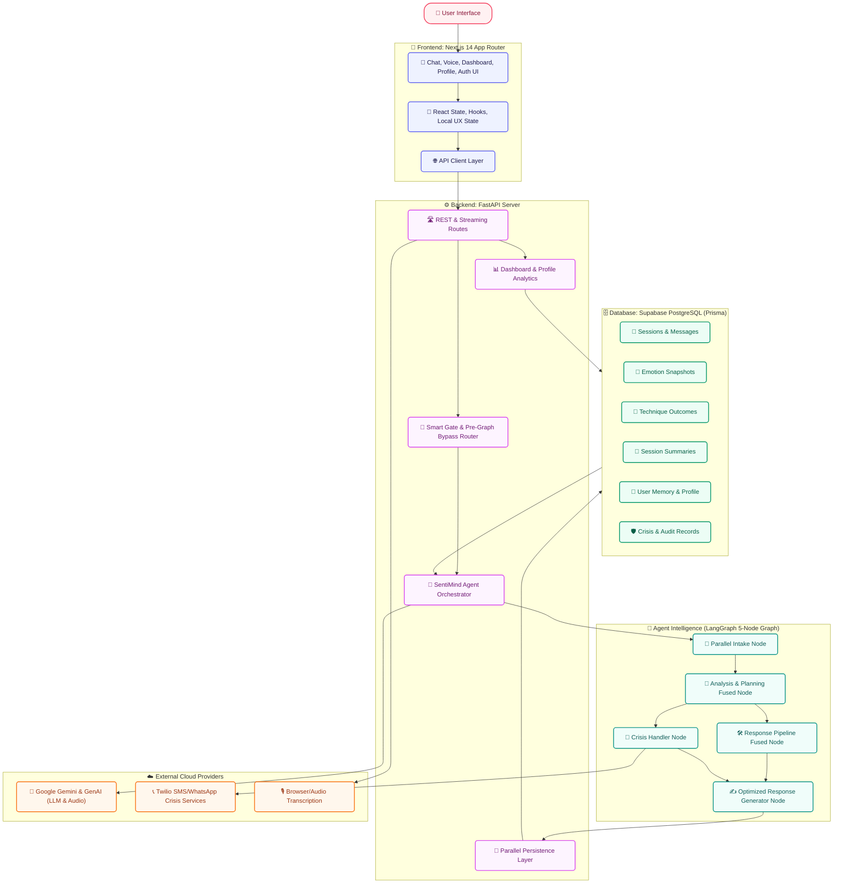

### Full Message Architecture

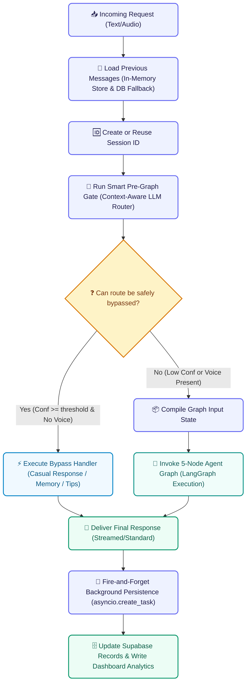

### Pre-Graph Gate

The pre-graph gate is the most important routing layer. It happens before LangGraph runs and is shared by normal chat and streaming chat. The gate is not a single check; it is a staged dispatcher that leverages parallel database loading and semantic LLM understanding to bypass or run the graph.

Main modules:

- `mental_health_wellness/src/mental_health_wellness/agent/graph.py`
- `mental_health_wellness/src/mental_health_wellness/llm/llm_classifier.py`
- `mental_health_wellness/src/mental_health_wellness/utils/turn_lifecycle.py`
- `mental_health_wellness/src/mental_health_wellness/utils/turn_signals.py`
- `mental_health_wellness/src/mental_health_wellness/utils/distress_anchor.py`

```mermaid
flowchart TD
    classDef step fill:#EEF2FF,stroke:#6366F1,stroke-width:2px,color:#1E1B4B,rx:6px,ry:6px;
    classDef parallel fill:#FDF4FF,stroke:#D946EF,stroke-width:2px,color:#701A75,rx:6px,ry:6px;
    classDef decision fill:#FEF3C7,stroke:#D97706,stroke-width:2px,color:#78350F;
    classDef bypass fill:#F0F9FF,stroke:#0284C7,stroke-width:2px,color:#075985,rx:6px,ry:6px;
    classDef graph fill:#F0FDFA,stroke:#0D9488,stroke-width:2px,color:#115E59,rx:6px,ry:6px;

    Start["📥 Latest User Message"]:::step
    LoadHistory["📜 Load Recent Message History (In-Memory / DB Fallback)"]:::step
    
    subgraph FetchParallel["🔄 Parallel Context Load (asyncio.gather)"]
        UserFacts["🧠 User Facts (Memory Extraction)"]:::parallel
        SessionSumm["📂 Session Summaries & Titles"]:::parallel
        SessionFacts["📋 Stored Session Facts & Techniques"]:::parallel
    end

    GateLLM["🚦 Smart Pipeline Gate (LLM Classifier)"]:::step
    Normalize["🔄 Normalization: Map Old Route Labels & Flags"]:::step
    FollowupProtect["🛡️ Contextual Follow-up Protection (Anchor Safeguard)"]:::step
    TurnGuess["💡 Initial Turn Type Guess (Lifecycle Stage)"]:::step
    VoiceGuard{"🎤 Voice/Audio Data Present?"}:::decision
    BypassAllowed{"❓ Bypass Conf >= Threshold?"}:::decision
    Bypass["⚡ Execute Fast Bypass Response (Chitchat, Memory, list_tips)"]:::bypass
    FullGraph["🤖 Build Graph Input State & Run 5-Node Agent Graph"]:::graph

    Start --> LoadHistory
    LoadHistory --> FetchParallel
    FetchParallel --> GateLLM
    GateLLM --> Normalize
    Normalize --> FollowupProtect
    FollowupProtect --> TurnGuess
    TurnGuess --> VoiceGuard
    VoiceGuard -- Yes (Force Graph) --> FullGraph
    VoiceGuard -- No --> BypassAllowed
    BypassAllowed -- Yes --> Bypass
    BypassAllowed -- No --> FullGraph
```

#### What The Pre-Gate Loads

The gate builds enough context to route safely without running the whole graph:

- Latest user message.
- Last few in-memory conversation turns.
- Database fallback message history when available.
- Stored user context and memory snippets.
- Current session summary, facts, and formatted session context.
- Latest recommended technique, pending technique, rejected technique, and active technique from session context.
- Previous assistant question and expected answer type.
- Prior exercise consent and solution preference.
- Voice metadata when a voice request already supplied it.

#### What The Pre-Gate Checks

The deterministic safety net checks narrow, high-precision crisis language before the LLM router:

- Explicit intent to kill oneself, end one's life, take one's life, or die.
- Statements of plan or immediate action.
- Means such as pills, knife, gun, rope, or blade with intent context.
- Recent self-harm or current self-harm.
- Passive suicidal ideation such as not wanting to exist, wanting to disappear forever, or everyone being better off without the user.

The Gemini gate then classifies the latest message using recent conversation and stored context. Active route labels are:

- `chitchat`
- `therapeutic`
- `contextual_followup`
- `technique_request`
- `technique_follow_up`
- `memory_query`
- `crisis`
- `positive_feedback`

The gate specifically checks:

- Crisis override before ordinary support.
- Whether a short answer depends on the previous assistant question.
- Whether the user is answering a duration, subject, trigger, or context question.
- Whether pronouns such as "it", "that", or "that exercise" refer to prior session context.
- Whether the user says there are no more details, which marks context complete.
- Whether a technique was rejected or did not help.
- Whether a short affirmation means technique acceptance or merely answers a context question.
- Whether "thanks" is just polite acknowledgement rather than outcome evidence.
- Whether "no thanks" after a technique offer means declined exercise consent.
- Whether the user reports a positive result after a technique.
- Whether the user asks about prior memory, previous session content, or a technique name.
- Whether the user is making a new emotional disclosure.
- Whether the user explicitly asks for a coping exercise or technique.
- Whether the message is casual small talk with no distress.
- Whether the user corrects old context or suppresses a topic.

The gate also extracts structured preference fields:

- `exercise_consent`: `unknown`, `denied`, or `allowed`.
- `solution_preference`: `unknown`, `listen_only`, `advice_allowed`, or `exercise_requested`.
- `suppression_signal`: whether the user corrected prior history.
- `suppressed_topic`: the topic/person/source the user says not to use.
- `active_issue_source`: the corrected active concern when provided.

#### Gate Normalization And Guardrails

After the LLM responds, the result is normalized and hardened:

- Old route labels are converted to current labels.
- `accept_technique` becomes `technique_follow_up` with `accept_technique` flag.
- `rejection` becomes `technique_follow_up` with rejection flags.
- `list_techniques` becomes `technique_request` with `list_techniques` flag.
- Unknown routes fall back to `therapeutic`.
- Positive outcome language forces `positive_feedback`.
- Negative exercise feedback forces `technique_follow_up`.
- Polite acknowledgement forces `chitchat` unless there is immediate technique-consent context.
- "No more details" forces `contextual_followup` and adds `context_complete`.
- Memory questions about old techniques get `technique_name_query`.
- Contextual follow-ups get lower intensity hints and mood-analysis skip flags.
- Chitchat and memory routes get near-zero intensity hints.
- Crisis gets high intensity and full pipeline.

When the gate says `therapeutic` but the message is a short answer to the last assistant question inside an active distress thread, `_protect_contextual_followup_gate()` can correct it to `contextual_followup`. This protects the original distress anchor from being overwritten by low-signal follow-up text.

#### Gate Bypass Routes

The bypass dispatcher in `_execute_gate_route()` can answer without running the full graph when the route is safe and voice emotion is not involved.

```mermaid
flowchart TD
    %% Class Definitions
    classDef step fill:#EEF2FF,stroke:#6366F1,stroke-width:2px,color:#1E1B4B,rx:6px,ry:6px;
    classDef decision fill:#FEF3C7,stroke:#D97706,stroke-width:2px,color:#78350F;
    classDef bypass fill:#F0F9FF,stroke:#0284C7,stroke-width:2px,color:#075985,rx:6px,ry:6px;
    classDef graph fill:#F0FDFA,stroke:#0D9488,stroke-width:2px,color:#115E59,rx:6px,ry:6px;
    classDef persist fill:#ECFDF5,stroke:#059669,stroke-width:2px,color:#065F46,rx:6px,ry:6px;

    GateResult["🚦 Gate Result"]:::step
    ConsentBlock{"❓ Prior listen-only or exercise refusal blocks technique?"}:::decision
    VoicePresent{"🎤 Audio or voice features present?"}:::decision
    Route{"🛣️ Route"}:::decision
    
    Chitchat["💬 chitchat: fast casual LLM response"]:::bypass
    Memory["🧠 memory_query: answer from facts or session context"]:::bypass
    TechniqueList["📋 technique_request: list techniques"]:::bypass
    TechniqueAccept["🎯 technique_follow_up accept: deliver DB technique"]:::bypass
    TechniqueReject["🙅 technique_follow_up reject: acknowledge rejection"]:::bypass
    Positive["👍 positive_feedback: acknowledge outcome & record success"]:::bypass
    Crisis["🚨 crisis: direct safety pre-screener response"]:::bypass
    
    Full["🤖 Full Graph (therapeutic route)"]:::graph
    Persist["💾 Background persist bypass turn"]:::persist

    GateResult --> ConsentBlock
    ConsentBlock -- Yes (blocked) --> Full
    ConsentBlock -- No (allowed) --> VoicePresent
    VoicePresent -- Yes (force graph) --> Full
    VoicePresent -- No --> Route
    
    Route -- chitchat --> Chitchat
    Route -- memory_query --> Memory
    Route -- list_techniques --> TechniqueList
    Route -- accept_technique --> TechniqueAccept
    Route -- reject_technique --> TechniqueReject
    Route -- positive_feedback --> Positive
    Route -- crisis --> Crisis
    Route -- therapeutic/unresolved --> Full
    
    Chitchat --> Persist
    Memory --> Persist
    TechniqueList --> Persist
    TechniqueAccept --> Persist
    TechniqueReject --> Persist
    Positive --> Persist
    Crisis --> Persist
```

Bypass is deliberately disabled for voice turns. If audio or voice features exist, the system forces the full graph so voice preprocessing and emotion fusion are not dropped.

#### Full Graph Input State

When bypass is not used, the gate builds the graph state with:

- `messages`
- `message`
- `user_id`
- `session_id`
- `gate_route`
- `gate_confidence`
- `gate_context_flags`
- `gate_emotional_register`
- `gate_intensity_hint`
- `gate_should_skip_mood_analysis`
- `gate_needs_full_pipeline`
- `prefetched_intent`
- `prefetched_user_context`
- `prefetched_session_context`
- `turn_type_guess`
- `previous_turn_context`
- session message count
- voice file path, voice features, transcription confidence, and voice feature snapshot when present

### Agent Graph Internals

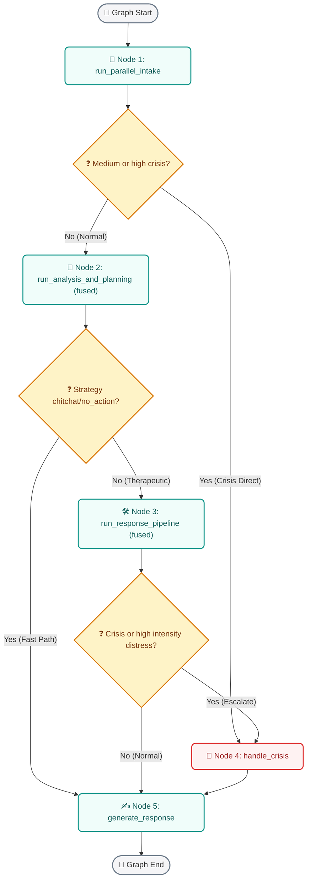

The graph has no LangGraph checkpointer. It uses `_message_store` for bounded in-memory message history and `_session_context_store` for compact session continuity. This reduces serialization overhead and keeps hot path latency lower.

### Node 1: Parallel Intake

Primary module:

- `nodes/parallel_intake.py`

Inline work:

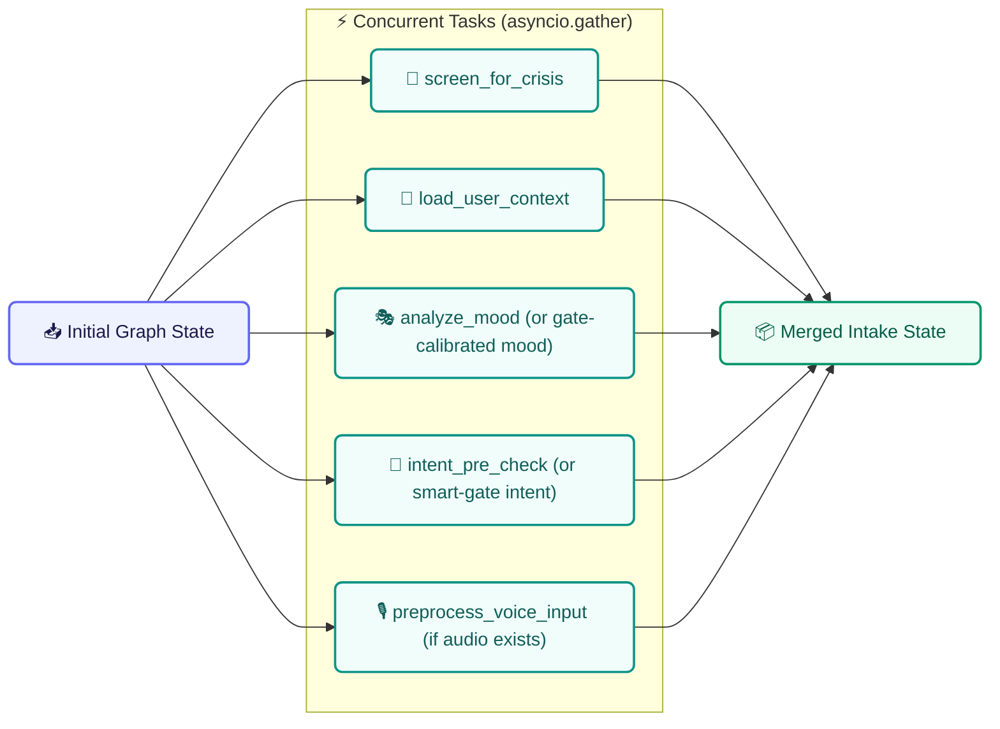

What it checks and produces:

- Skips duplicate crisis LLM when smart gate already made a confident non-crisis route.
- Runs backup crisis screen when the gate route is crisis, uncertain, or configured to duplicate crisis checks.
- Loads DB-backed user context, summaries, facts, memory, preferences, and chat history.
- Runs mood analysis unless the gate marks the turn as low-signal, contextual, memory, chitchat, positive feedback, technique follow-up, or voice-authoritative.
- Uses gate-calibrated mood for low-signal routes.
- Uses voice features as authoritative mood source when Gemini audio features are present.
- Runs intent pre-check only when the smart gate did not already provide authoritative intent.
- Runs voice preprocessing only when audio exists and voice features are not already processed.
- Preserves distress anchors so contextual replies do not lower or overwrite the true initial intensity.
- Emits emotion, sentiment, intensity, confidence, sub-emotions, symptoms, behaviors, contexts, crisis state, intent, memory context, and voice metadata.

### Node 2: Analysis And Planning

Primary module:

- `nodes/analysis_and_planning.py`

Inline subnodes:

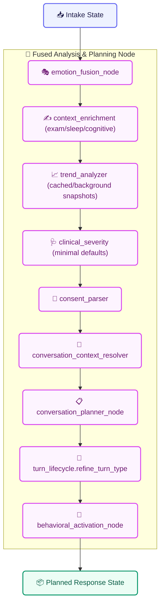

What it checks and produces:

- Fuses text and voice emotion into `fused_emotion` and `fused_intensity`.
- For therapeutic or crisis voice turns, passes authoritative Gemini audio emotion through with safety post-processing.
- For text-only turns, applies intensity normalization, neutral caps, hedge-word reduction, passive ideation checks, gate caps, and distress anchor guard.
- Detects mismatch and possible masking between text and voice signals.
- Enriches exam, study, sleep, bedtime rumination, fear-of-failure, catastrophic thought, and environment trigger context.
- Sets cognitive distortion hints such as catastrophizing when deterministic context supports it.
- Uses cached emotional trend or schedules trend refresh in the background.
- Sets clinical defaults to minimal unless optional heavier analysis is enabled.
- Parses consent, suppressed topics, corrected history, active issue source, and solution preference.
- Resolves short replies and pronouns against the last assistant question, active thread, active technique, and session context.
- Chooses conversation strategy through the planner.
- Refines lifecycle turn type from gate guess into final `INITIAL_DISCLOSURE`, `FOLLOW_UP_DISCLOSURE`, `CONTEXT_GATHERING`, `POST_RECOMMENDATION_REACTION`, or `CRISIS_DISCLOSURE`.
- Optionally adds a behavioral activation micro-action when the feature flag allows it.

Planner strategy outputs include:

- `no_action`
- `validate_only`
- `ask_question`
- `encourage_reflection`
- `reframe`
- `suggest_technique`
- `distract`

Planner phase outputs include:

- `neutral`
- `venting`
- `reflection`
- `solution`
- `recovery`

### Node 3: Response Pipeline

Primary module:

- `nodes/response_pipeline.py`

Inline subnodes:

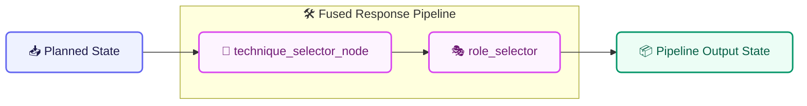

What it checks and produces:

- Checks `conversation_strategy` and `technique_readiness`.
- Honors exercise consent and listen-only preferences before selecting exercises.
- Preserves pending recommended technique until the user consents.
- Anchors short consent turns to the real underlying distress emotion.
- Searches active DB techniques semantically against emotion, sub-emotion, symptoms, behaviors, contexts, concern, and intensity.
- Filters out unsuitable or suppressed techniques.
- Returns `recommended_technique`, `recommended_techniques_by_category`, `alternative_techniques`, `technique_candidates`, and `latest_recommended_technique`.
- Selects communication role from crisis state, fused intensity, trend, and phase.

Role rules:

- Crisis detected means `crisis_support`.
- Worsening trend with intensity at or above `0.6` can escalate to `trainer`.
- Reflection phase keeps the role gentler: `coach` or `friend`.
- Intensity below `0.4` means `friend`.
- Intensity from `0.4` to below `0.7` means `coach`.
- Intensity at or above `0.7` means `trainer`.

### Node 4: Crisis Handler

Primary module:

- `nodes/crisis_handler.py`

What it checks and produces:

- Trusts crisis pre-screener level when present.
- Escalates if crisis tools were explicitly called.
- Treats medium and high risk as crisis.
- Loads saved emergency contacts only when scoped emergency-contact consent allows it.
- Builds enriched crisis details from text emotion, fused emotion, sentiment, intensity, message preview, and voice features.
- Sends WhatsApp or SMS crisis alerts through configured Twilio services when appropriate.
- Adds voice/text conflict details when voice emotion and text emotion disagree.
- Sets crisis flags and metadata for the response generator.
- Does not create the final user-facing text itself; it routes to response generation so the crisis reply is contextual and consistent.

### Node 5: Optimized Response Generator

Primary module:

- `nodes/optimized_response_generator.py`

What it checks and produces:

- Uses a fast casual prompt for `no_action`.
- Builds a full system prompt for therapeutic, crisis, memory, technique, and follow-up turns.
- Injects recent bounded history from graph state.
- Injects cross-session memory context.
- Injects response strategy, phase, trend, distortion hints, micro-action, consent preference, and suppressed topic instructions.
- Adds possible emotion mismatch guidance when voice/text mismatch or masking is detected.
- Adds rejection override when the user rejected a technique.
- Adds acceptance override when the user accepted a pending or prior technique.
- Lets the final response LLM choose from valid technique candidates when needed.
- Cleans accidental model metadata prefixes from the final reply.
- Avoids repeated empathy openings across adjacent turns.
- Marks `technique_offered_this_turn` only if the final text actually includes the selected technique.
- Emits `turn_technique_id` only when a technique was truly offered.
- Returns `final_response`, `response_task`, candidate metadata, and technique-offer flags.

### Post-Response Background Persistence

Primary module:

- `nodes/parallel_persist.py`

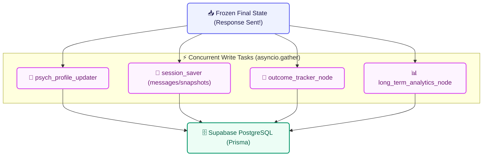

What it writes:

- User psychological profile refresh.
- User and assistant messages.
- Emotion snapshots.
- Mood logs and session fields.
- Pending or resolved technique outcomes.
- Long-term analytics snapshots and dashboard aggregates.
- Structured session handoff for the next session.

Failures in background persistence are logged and do not crash the user-facing response.

### Design Intent

SentiMind separates responsibilities into small layers:

- The frontend owns interaction quality, screens, voice controls, and user-facing dashboards.
- The API owns HTTP contracts, streaming, authentication boundaries, and request orchestration.
- The pre-graph gate protects latency and safety by separating bypassable turns from turns that need full therapeutic analysis.
- The agent graph owns deeper emotional reasoning, planning, crisis decisions, response strategy, and technique decisions.
- Persistence runs in parallel where possible so user latency stays low.
- Supabase stores both conversational history and analytic signals.
- Dashboard services transform raw records into user-facing trend views.

## Runtime Flow

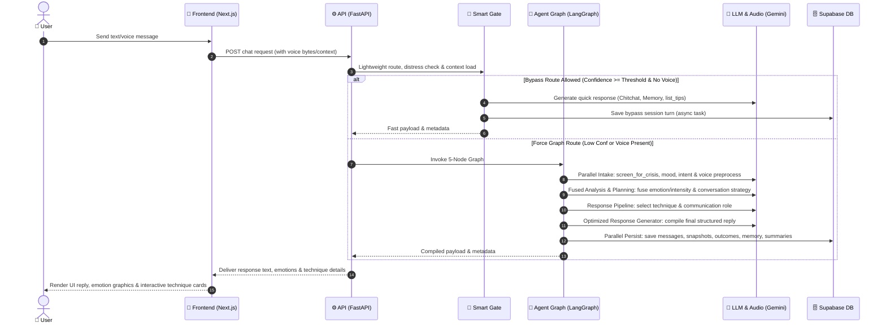

### Request Categories

- Text chat uses standard FastAPI routes and the agent graph.
- Streaming chat returns incremental model output while keeping persistence intact.
- Voice chat transcribes audio first, then routes based on transcript meaning.
- Dashboard requests bypass the agent and read analytic aggregates from Supabase.
- Crisis actions use dedicated safety routes and Twilio-backed integrations.

## Agent Graph

The agent is intentionally compact: five graph nodes with conditional routing between them. The heavy work happens inside specialized node modules, while the graph keeps orchestration readable.


### Why This Shape Works

- Intake work runs early and in parallel.
- Crisis handling remains reachable before and after deeper analysis.
- Simple turns can skip the expensive response pipeline.
- Complex emotional turns still receive full planning, memory, technique, and analytics support.
- Response generation is the final common exit, so the assistant style remains consistent.

## Node Analysis

### 1. Parallel Intake

Primary module:

- `mental_health_wellness/src/mental_health_wellness/nodes/parallel_intake.py`

Responsibilities:

- Load context required for the current turn.
- Run early classification and extraction tasks.
- Prepare the shared agent state for analysis.
- Keep latency low by avoiding unnecessary sequential work.

Important collaborators:

- `context_loader.py`
- `intent_classifier.py`
- `crisis_detection_node.py`
- `memory_extraction_node.py`
- `smart_gate_node.py`

### 2. Analysis And Planning

Primary module:

- `mental_health_wellness/src/mental_health_wellness/nodes/analysis_and_planning.py`

Responsibilities:

- Convert raw intake signals into a response plan.
- Refine lifecycle turn type after emotion and route context are known.
- Decide whether the response needs deeper therapeutic processing.
- Prepare strategy fields consumed by the response generator.

Key outputs:

- `conversation_phase`
- `response_strategy`
- `turn_type`
- `intervention_type`
- crisis escalation state
- technique readiness state

### 3. Response Pipeline

Primary module:

- `mental_health_wellness/src/mental_health_wellness/nodes/response_pipeline.py`

Responsibilities:

- Select or suppress therapeutic techniques.
- Format active and alternative techniques.
- Track outcomes from previous technique offers.
- Select communication role (e.g. coach, friend, trainer, crisis support).

Important collaborators:

- `mental_health_wellness/src/mental_health_wellness/utils/technique_selector.py`
- `mental_health_wellness/src/mental_health_wellness/utils/role_selector.py`

### 4. Crisis Handler

Primary module:

- `mental_health_wellness/src/mental_health_wellness/nodes/crisis_handler.py`

Responsibilities:

- Produce crisis-safe response state.
- Avoid ordinary therapeutic technique framing during emergency-like turns.
- Connect crisis route metadata to API-level safety features and emergency alerts.
- Preserve auditability for crisis events.
- Enforce emergency contact verification and alert dispatch via SMS/WhatsApp.

Important collaborators:

- `mental_health_wellness/src/mental_health_wellness/services/twilio_crisis.py`
- `mental_health_wellness/src/mental_health_wellness/utils/distress_anchor.py`

### 5. Optimized Response Generator

Primary module:

- `mental_health_wellness/src/mental_health_wellness/nodes/optimized_response_generator.py`

Responsibilities:

- Create the final assistant response.
- Respect route, phase, lifecycle, crisis, and voice-fusion guidance.
- Mark `technique_offered_this_turn` only when the final assistant message actually offers the selected technique.
- Avoid claiming the user feels differently when text and voice signals conflict.

## Lifecycle And Outcome Tracking

The lifecycle layer exists because mood analytics become noisy if every turn is treated as the same kind of emotional disclosure. A short "thanks" after a technique should not be scored like a new distress report, and a context-only answer should not distort mood improvement graphs.

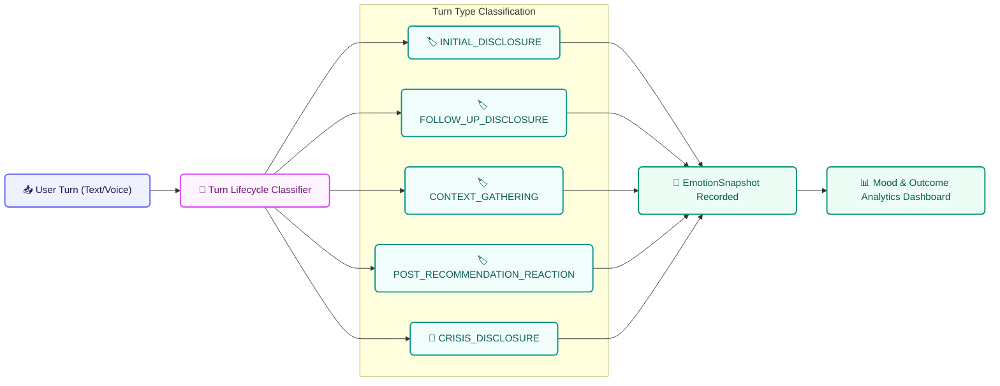

### Turn Type Meaning

- `INITIAL_DISCLOSURE` means the first meaningful emotional disclosure in a session.
- `FOLLOW_UP_DISCLOSURE` means a later emotional update in the same session.
- `CONTEXT_GATHERING` means the user is answering facts or logistics without a new mood signal.
- `POST_RECOMMENDATION_REACTION` means the user is reacting after a technique or recommendation.
- `CRISIS_DISCLOSURE` means the turn contains crisis-level safety concerns.

### Outcome Flow

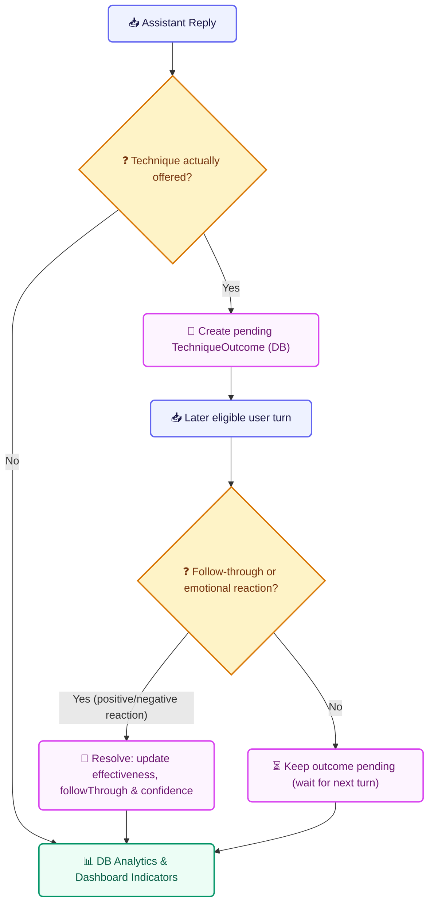

This supports cleaner questions such as:

- Did the user's intensity decrease after an actual technique offer?
- Was there enough follow-through evidence to score the technique?
- Is the dashboard comparing real disclosures instead of polite acknowledgements?
- Did the session peak improve by the final qualifying emotional snapshot?

## Voice And Emotion Fusion

Voice handling is route-aware. The system can transcribe audio and capture voice feature signals, but voice emotion is not forced into every route. The transcript drives routing first; voice features are linked into therapeutic or crisis processing when that route supports emotion fusion.

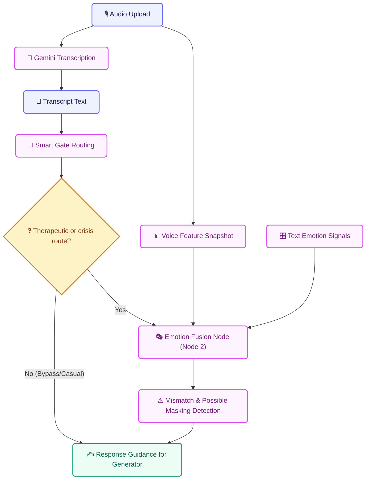

Persisted fusion metadata includes:

- text and voice mismatch
- possible masking
- fusion confidence
- transcription confidence
- voice feature snapshot
- conversation phase
- response strategy

The response prompt is instructed to acknowledge uncertainty carefully and never assert that the user feels something different from what they said.

## Crisis Safety

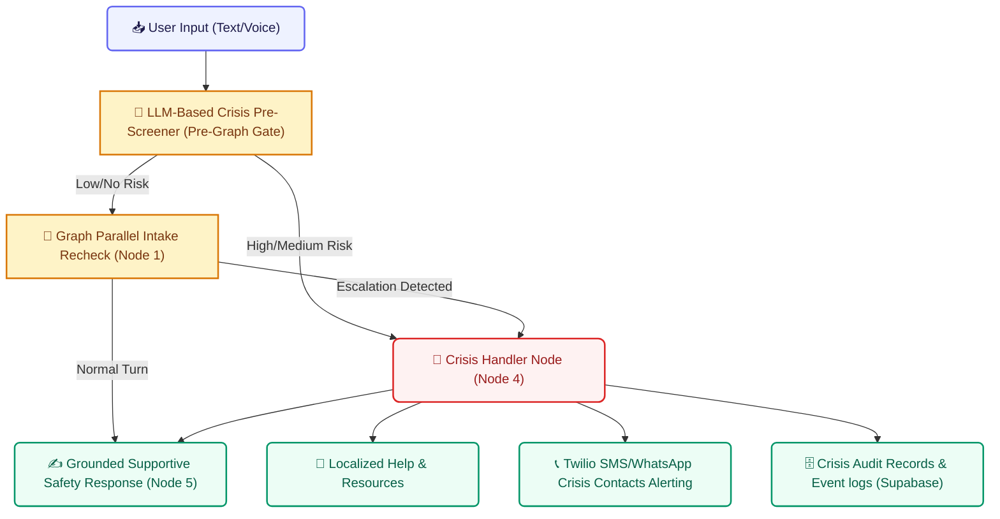

Crisis features include:

- Context-aware LLM-based crisis pre-screener in the pre-graph gate
- Parallel intake validation check inside the graph as a redundant fail-safe
- Dedicated crisis handler node managing distress peaks and emergency escalation
- Stored emergency contact integration and automatic alerts via Twilio (SMS/WhatsApp)
- Secure crisis audit database logs for clinical compliance and dashboard tracking
- Safety-first grounded response templates generated by Node 5

## Memory And Personalization

SentiMind uses several memory layers so the assistant can remain continuous without treating every message as isolated.

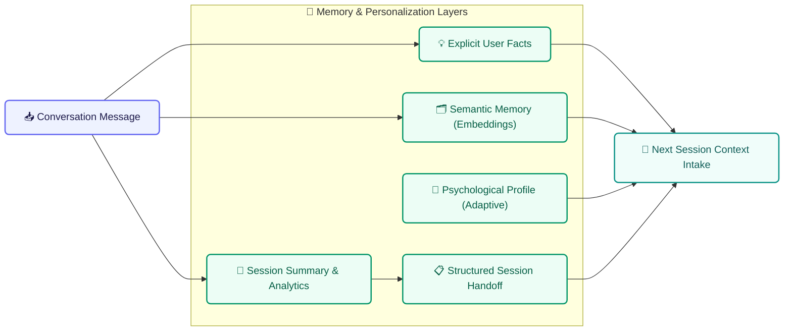

Memory responsibilities:

- `memory/explicit_facts.py` extracts durable facts and stores them in the DB.
- `memory/semantic_memory.py` coordinates embedding-based search for past topic matches.
- `nodes/session_saver.py` updates dynamic user profile metadata, session summaries, and structured handoffs.
- `agent/graph.py` (pre-graph loader) injects relevant prior-session context into the smart pre-graph gate.

## Dashboard Analytics

Dashboard analytics intentionally ignore noisy turn types when calculating improvement. This is where lifecycle tagging directly helps the product.

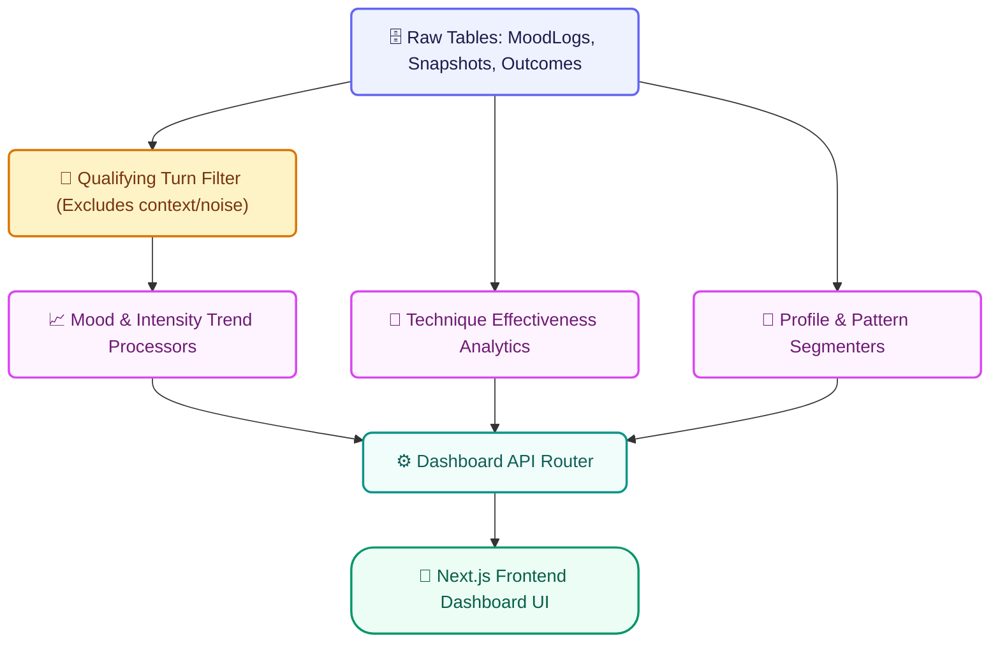

Qualifying mood records include:

- `INITIAL_DISCLOSURE`
- `FOLLOW_UP_DISCLOSURE`
- `POST_RECOMMENDATION_REACTION`
- `CRISIS_DISCLOSURE`
- legacy `MoodLog` records

Excluded from improvement trend scoring:

- `CONTEXT_GATHERING`
- short acknowledgements without outcome evidence
- assistant technique offers with no later user reaction

This makes the dashboard better at answering whether mood is increasing, decreasing, or stabilizing over time.

## Database Design

```mermaid
flowchart TB
    %% Class Definitions
    classDef user fill:#FFF1F2,stroke:#F43F5E,stroke-width:2px,color:#881337,rx:20px,ry:20px;
    classDef convo fill:#EEF2FF,stroke:#6366F1,stroke-width:2px,color:#1E1B4B,rx:6px,ry:6px;
    classDef wellness fill:#FDF4FF,stroke:#D946EF,stroke-width:2px,color:#701A75,rx:6px,ry:6px;
    classDef memory fill:#F0FDFA,stroke:#0D9488,stroke-width:2px,color:#115E59,rx:6px,ry:6px;
    classDef safety fill:#FEF2F2,stroke:#DC2626,stroke-width:2px,color:#991B1B,rx:6px,ry:6px;

    User["👤 User Entity"]:::user

    subgraph Conversation["💬 Conversation Domain"]
        Session["Session (Active/Peak Tracking)"]:::convo
        Message["Message (Conversational History)"]:::convo
        EmotionSnapshot["EmotionSnapshot (Turn-level Fused Emotion)"]:::convo
        SessionSummary["SessionSummary (Final summary & Handoff)"]:::convo
    end

    subgraph Wellness["🛠️ Wellness & Technique Domain"]
        MoodLog["MoodLog (Self-reports)"]:::wellness
        TechniqueOutcome["TechniqueOutcome (Active/Pending Outcome)"]:::wellness
        UserTechniquePreference["UserTechniquePreference (Consent/Refusals)"]:::wellness
        PsychProfile["Psychological Profile (Trait Tracking)"]:::wellness
    end

    subgraph MemoryDomain["🧠 Memory Domain"]
        UserMemory["UserMemory (Long-term profile)"]:::memory
        SemanticMemory["SemanticMemory (Embeddings)"]:::memory
        ExplicitFact["ExplicitFact (Extracted fact facts)"]:::memory
    end

    subgraph SafetyDomain["🛡️ Safety & Auditing Domain"]
        CrisisEvent["CrisisEvent (Trigger logs)"]:::safety
        CrisisResource["CrisisResource (Help desks)"]:::safety
        TrustedContact["TrustedContact (Emergency verification)"]:::safety
        AuditLog["AuditLog (Admin/Usage audits)"]:::safety
    end

    User --> Session
    Session --> Message
    Session --> EmotionSnapshot
    Session --> SessionSummary
    User --> MoodLog
    User --> TechniqueOutcome
    User --> UserTechniquePreference
    User --> PsychProfile
    User --> UserMemory
    User --> SemanticMemory
    User --> ExplicitFact
    User --> CrisisEvent
    User --> TrustedContact
    CrisisEvent --> CrisisResource
    User --> AuditLog
```

Important schema areas:

- `Session` stores session state, mood summary, and peak intensity tracking.
- `Message` stores user and assistant messages plus assistant technique offer flags.
- `EmotionSnapshot` stores emotion, intensity, lifecycle type, fusion metadata, and technique linkage.
- `TechniqueOutcome` stores pending and resolved intervention outcomes.
- `SessionSummary` stores final emotion, final intensity, turn type counts, and handoff data.
- `MoodLog` preserves explicit mood logging and legacy trend support.
- Memory tables store user facts, semantic memories, and profile signals.
- Crisis and audit tables support safety and compliance-oriented records.

## Complete Route Flow

This route map is generated from the active FastAPI decorators in:

- `mental_health_wellness/src/mental_health_wellness/api/app.py`
- `mental_health_wellness/src/mental_health_wellness/api/crisis_routes.py`
- `mental_health_wellness/src/mental_health_wellness/api/dashboard_routes.py`

### Backend Route Topology

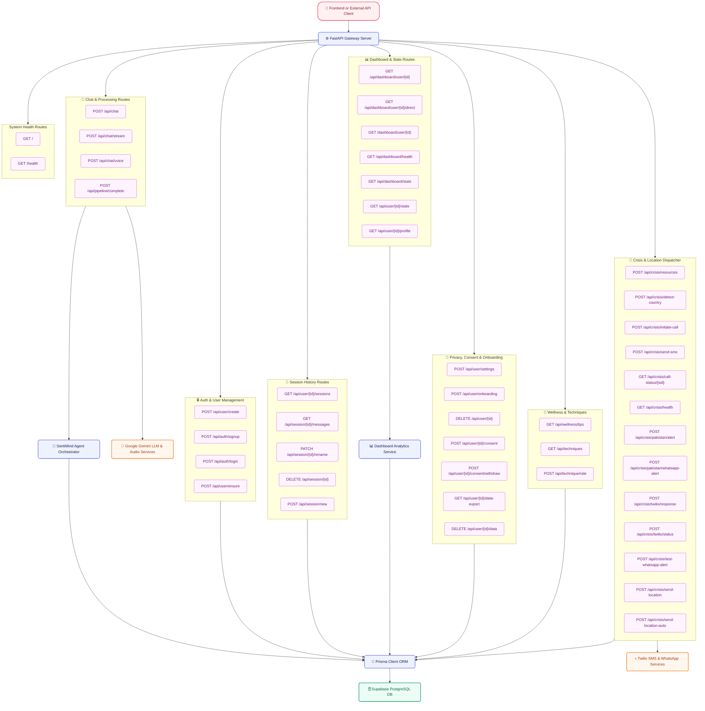

### Chat Route Flow

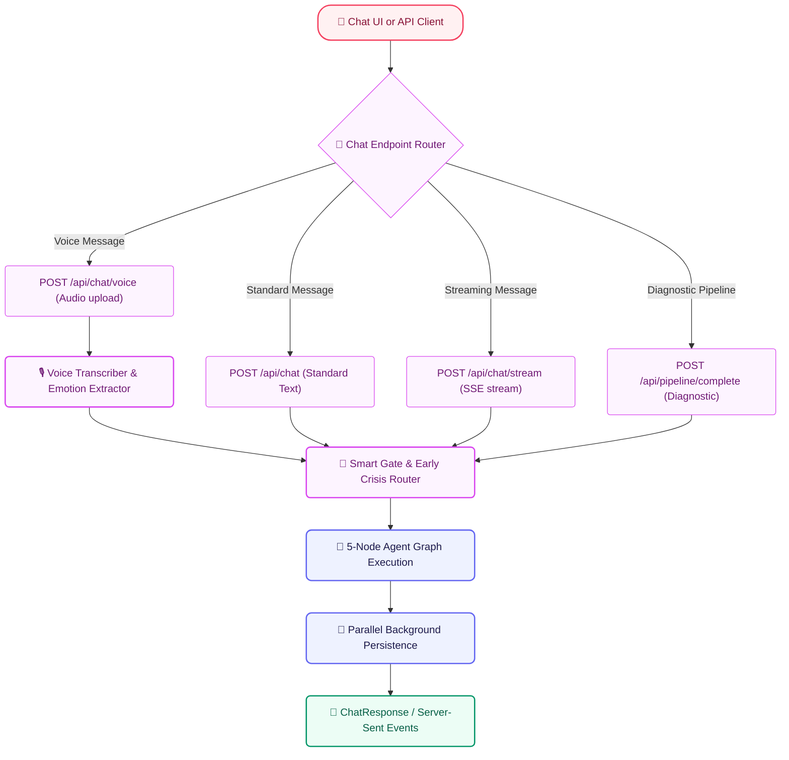

### Session And Dashboard Flow

```mermaid
flowchart TD
    %% Class Definitions
    classDef client fill:#FFF1F2,stroke:#F43F5E,stroke-width:2px,color:#881337,rx:20px,ry:20px;
    classDef screen fill:#EEF2FF,stroke:#6366F1,stroke-width:2px,color:#1E1B4B,rx:8px,ry:8px;
    classDef route fill:#FDF4FF,stroke:#D946EF,stroke-width:1px,color:#701A75,rx:4px,ry:4px;
    classDef main fill:#F0FDFA,stroke:#0D9488,stroke-width:2px,color:#115E59,rx:8px,ry:8px;

    Frontend["📱 Frontend React App"]:::client
    Sessions["📂 Session Navigator & Store"]:::screen
    Dashboard["📊 Interactive Dashboard View"]:::screen
    Profile["👤 User Settings & Profile Manager"]:::screen
    Prisma["🔌 Prisma ORM DB Layer"]:::main
    Analytics["📈 Analytics Integration Engine"]:::main

    Frontend --> Sessions
    Sessions --> S1["GET /api/user/{id}/sessions"]:::route
    Sessions --> S2["GET /api/session/{id}/messages"]:::route
    Sessions --> S3["PATCH /api/session/{id}/rename"]:::route
    Sessions --> S4["DELETE /api/session/{id}"]:::route
    Sessions --> S5["POST /api/session/new"]:::route

    Frontend --> Dashboard
    Dashboard --> D1["GET /api/dashboard/user/{id}"]:::route
    Dashboard --> D2["GET /dashboard/user/{id}"]:::route
    Dashboard --> D3["GET /api/dashboard/health"]:::route
    Dashboard --> D4["GET /api/dashboard/stats"]:::route
    Dashboard --> D5["GET /api/user/{id}/stats"]:::route

    Frontend --> Profile
    Profile --> P1["GET /api/user/{id}/profile"]:::route
    Profile --> P2["POST /api/user/settings"]:::route
    Profile --> P3["POST /api/user/onboarding"]:::route
    Profile --> P4["GET /api/user/{id}/data-export"]:::route
    Profile --> P5["DELETE /api/user/{id}/data"]:::route
    Profile --> P6["DELETE /api/user/{id}"]:::route

    S1 --> Prisma
    S2 --> Prisma
    S3 --> Prisma
    S4 --> Prisma
    S5 --> Prisma
    D1 --> Analytics
    D2 --> Analytics
    D3 --> Analytics
    D4 --> Prisma
    D5 --> Prisma
    P1 --> Prisma
    P2 --> Prisma
    P3 --> Prisma
    P4 --> Prisma
    P5 --> Prisma
    P6 --> Prisma
```

### Crisis Route Flow

```mermaid
flowchart TD
    %% Class Definitions
    classDef client fill:#FFF1F2,stroke:#F43F5E,stroke-width:2px,color:#881337,rx:20px,ry:20px;
    classDef route fill:#FEF2F2,stroke:#DC2626,stroke-width:1px,color:#991B1B,rx:4px,ry:4px;
    classDef main fill:#EEF2FF,stroke:#6366F1,stroke-width:2px,color:#1E1B4B,rx:8px,ry:8px;
    classDef ext fill:#FFF7ED,stroke:#F97316,stroke-width:2px,color:#9A3412,rx:6px,ry:6px;
    classDef audit fill:#ECFDF5,stroke:#059669,stroke-width:2px,color:#065F46,rx:6px,ry:6px;

    CrisisUI["📱 Crisis UI / Safety Trigger / Twilio Webhook"]:::client
    
    subgraph Endpoints["🚨 Crisis Gateway Routes"]
        Resources["POST /api/crisis/resources"]:::route
        Country["POST /api/crisis/detect-country"]:::route
        Call["POST /api/crisis/initiate-call"]:::route
        Sms["POST /api/crisis/send-sms"]:::route
        CallStatus["GET /api/crisis/call-status/{sid}"]:::route
        Health["GET /api/crisis/health"]:::route
        PakistanAlert["POST /api/crisis/pakistan/alert"]:::route
        PakistanWhatsapp["POST /api/crisis/pakistan/whatsapp-alert"]:::route
        TwilioResponse["POST /api/crisis/twilio/response"]:::route
        TwilioStatus["POST /api/crisis/twilio/status"]:::route
        TestWhatsapp["POST /api/crisis/test-whatsapp-alert"]:::route
        Location["POST /api/crisis/send-location"]:::route
        AutoLocation["POST /api/crisis/send-location-auto"]:::route
    end

    CrisisServices["⚙️ Crisis Resource & Country Services"]:::main
    TwilioService["📞 Twilio SMS & WhatsApp Dispatchers"]:::ext
    Audit["🗄️ Crisis Audit Logging (Supabase)"]:::audit

    CrisisUI --> Resources
    CrisisUI --> Country
    CrisisUI --> Call
    CrisisUI --> Sms
    CrisisUI --> CallStatus
    CrisisUI --> Health
    CrisisUI --> PakistanAlert
    CrisisUI --> PakistanWhatsapp
    CrisisUI --> TwilioResponse
    CrisisUI --> TwilioStatus
    CrisisUI --> TestWhatsapp
    CrisisUI --> Location
    CrisisUI --> AutoLocation

    Resources --> CrisisServices
    Country --> CrisisServices
    Call --> TwilioService
    Sms --> TwilioService
    CallStatus --> TwilioService
    PakistanAlert --> TwilioService
    PakistanWhatsapp --> TwilioService
    TwilioResponse --> TwilioService
    TwilioStatus --> TwilioService
    TestWhatsapp --> TwilioService
    Location --> TwilioService
    AutoLocation --> TwilioService
    
    TwilioService --> Audit
    CrisisServices --> Audit
```

### Frontend Route Flow

```mermaid
flowchart TB
    %% Class Definitions
    classDef client fill:#FFF1F2,stroke:#F43F5E,stroke-width:2px,color:#881337,rx:20px,ry:20px;
    classDef page fill:#EEF2FF,stroke:#6366F1,stroke-width:1.5px,color:#1E1B4B,rx:6px,ry:6px;
    classDef auth fill:#FEF3C7,stroke:#D97706,stroke-width:2px,color:#78350F,rx:6px,ry:6px;
    classDef backend fill:#FDF4FF,stroke:#D946EF,stroke-width:2px,color:#701A75,rx:8px,ry:8px;

    Browser["🌐 Browser Client"]:::client

    subgraph Pages[" Next.js Router Screens"]
        RootPage["🏠 / (Landing Page)"]:::page
        Login["🔐 /login"]:::page
        Signup["📝 /signup"]:::page
        Chat["💬 /chat (Default Session)"]:::page
        ChatSession["💬 /chat/[sessionId] (Active Session)"]:::page
        Crisis["🚨 /crisis (Safety Center)"]:::page
        Dashboard["📊 /dashboard (Analytics Portal)"]:::page
        Onboarding["🚀 /onboarding"]:::page
        Profile["👤 /profile"]:::page
        Privacy["🔒 /privacy"]:::page
        Terms["📄 /terms"]:::page
    end

    NextAuth["🔐 NextAuth.js /api/auth Routing"]:::auth
    Backend["⚙️ FastAPI Backend Service"]:::backend

    Browser --> RootPage
    Browser --> Login
    Browser --> Signup
    Browser --> Chat
    Browser --> ChatSession
    Browser --> Crisis
    Browser --> Dashboard
    Browser --> Onboarding
    Browser --> Profile
    Browser --> Privacy
    Browser --> Terms
    
    Login --> NextAuth
    Signup --> NextAuth
    NextAuth --> Backend
    Chat --> Backend
    ChatSession --> Backend
    Crisis --> Backend
    Dashboard --> Backend
    Onboarding --> Backend
    Profile --> Backend
```

## API Surface

### Main App Routes

System:

- `GET /` handled by `root`.
- `GET /health` handled by `health_check`.

Chat and pipeline:

- `POST /api/chat` handled by `chat`.
- `POST /api/chat/stream` handled by `chat_stream`.
- `POST /api/chat/voice` handled by `chat_voice`.
- `POST /api/pipeline/complete` handled by `pipeline_complete`.

Authentication and user bootstrap:

- `POST /api/user/create` handled by `create_user`.
- `POST /api/auth/signup` handled by `auth_signup`.
- `POST /api/auth/login` handled by `auth_login`.
- `POST /api/user/ensure` handled by `ensure_user`.

Sessions:

- `GET /api/user/{user_id}/sessions` handled by `get_user_sessions`.
- `GET /api/session/{session_id}/messages` handled by `get_session_messages`.
- `PATCH /api/session/{session_id}/rename` handled by `rename_session`.
- `DELETE /api/session/{session_id}` handled by `delete_session`.
- `POST /api/session/new` handled by `create_new_chat_session`.

Dashboard and profile:

- `GET /api/dashboard/user/{user_id}` handled by mounted dashboard router `get_user_dashboard`.
- `GET /api/dashboard/user/{user_id}` also exists as direct compatibility handler `dashboard_user_direct`.
- `GET /dashboard/user/{user_id}` handled by `dashboard_user_direct_no_api_prefix`.
- `GET /api/dashboard/health` handled by mounted dashboard router `dashboard_health`.
- `GET /api/dashboard/stats` handled by `get_dashboard_stats`.
- `GET /api/user/{user_id}/stats` handled by `get_user_stats_legacy`.
- `GET /api/user/{user_id}/profile` handled by `get_user_profile`.

Settings, onboarding, consent, and data rights:

- `POST /api/user/settings` handled by `save_user_settings`.
- `POST /api/user/onboarding` handled by `save_onboarding`.
- `DELETE /api/user/{user_id}` handled by `delete_user_account`.
- `POST /api/user/{user_id}/consent` handled by `record_consent`.
- `POST /api/user/{user_id}/consent/withdraw` handled by `withdraw_consent`.
- `GET /api/user/{user_id}/data-export` handled by `export_user_data`.
- `DELETE /api/user/{user_id}/data` handled by `delete_user_data`.

Techniques and wellness:

- `GET /api/wellness/tips` handled by `get_wellness_tips`.
- `GET /api/techniques` handled by `get_techniques`.
- `POST /api/technique/rate` handled by `rate_technique`.

### Crisis Router Routes

Mounted prefix:

- `/api/crisis`

Routes:

- `POST /api/crisis/resources` handled by `get_resources`.
- `POST /api/crisis/detect-country` handled by `detect_country`.
- `POST /api/crisis/initiate-call` handled by `initiate_crisis_call`.
- `POST /api/crisis/send-sms` handled by `send_crisis_sms`.
- `GET /api/crisis/call-status/{call_sid}` handled by `get_call_status`.
- `GET /api/crisis/health` handled by `crisis_health`.
- `POST /api/crisis/pakistan/alert` handled by `alert_pakistan_crisis_center`.
- `POST /api/crisis/pakistan/whatsapp-alert` handled by `alert_pakistan_whatsapp`.
- `POST /api/crisis/twilio/response` handled by `handle_twilio_response`.
- `POST /api/crisis/twilio/status` handled by `handle_twilio_status`.
- `POST /api/crisis/test-whatsapp-alert` handled by `test_whatsapp_alert`.
- `POST /api/crisis/send-location` handled by `send_location_alert`.
- `POST /api/crisis/send-location-auto` handled by `send_location_auto`.

### Active Frontend API Calls

The frontend API base is `NEXT_PUBLIC_API_URL`, defaulting to `http://localhost:8000/api`.

Auth flows:

- NextAuth credentials provider calls `POST /api/auth/signup`.
- NextAuth credentials provider calls `POST /api/auth/login`.
- Auth server action calls `POST /api/user/ensure`.

Chat flows:

- Streaming chat calls `POST /api/chat/stream`.
- Browser crisis GPS helper calls `POST /api/crisis/send-location`.
- Session actions call the session list, message list, rename, and delete routes.

Profile and onboarding flows:

- Profile action calls `GET /api/user/{user_id}/profile`.
- Profile action calls `POST /api/user/settings`.
- Profile action calls `GET /api/user/{user_id}/data-export`.
- Profile action calls `POST /api/user/{user_id}/consent/withdraw`.
- Profile action can call `DELETE /api/user/{user_id}` for legacy hard delete.
- Onboarding action calls `POST /api/user/onboarding`.

Known route mismatch:

- `frontend/src/actions/profile.ts` references `POST /api/user/erasure-request`.
- No matching FastAPI route is currently registered in the backend route inventory.
- Current backend data deletion route is `DELETE /api/user/{user_id}/data`.

## Frontend Architecture

```mermaid
flowchart TB
    %% Class Definitions
    classDef client fill:#EEF2FF,stroke:#6366F1,stroke-width:2px,color:#1E1B4B,rx:8px,ry:8px;
    classDef main fill:#FDF4FF,stroke:#D946EF,stroke-width:2px,color:#701A75,rx:6px,ry:6px;
    classDef backend fill:#F0FDFA,stroke:#0D9488,stroke-width:2px,color:#115E59,rx:8px,ry:8px;

    AppRouter["📱 Next.js App Router (Layouts/Routes)"]:::client
    Pages["📄 Route Pages (Chat, Dashboard, Profile)"]:::client
    Components["🧩 Reusable UI Components (Design System)"]:::client
    Hooks["🔄 Custom React Hooks (useAudio, useChat)"]:::client
    Lib["🌐 API & Utility Layer (Axios/Fetcher)"]:::client
    Contexts["👥 React Context Providers (Auth, Theme)"]:::client
    Backend["⚙️ FastAPI Backend Services"]:::backend

    AppRouter --> Pages
    Pages --> Components
    Components --> Hooks
    Hooks --> Lib
    Components --> Contexts
    Lib --> Backend
```

Frontend responsibilities:

- chat interface
- streaming response rendering
- voice upload and recording UI
- dashboard visualization
- profile and onboarding screens
- authentication screens
- protected route behavior
- crisis support surfaces
- API client integration

Important frontend folders:

- `frontend/src/app`
- `frontend/src/components`
- `frontend/src/hooks`
- `frontend/src/lib`
- `frontend/src/contexts`
- `frontend/src/types`

## Repository Structure

```text
E:\FYP
  frontend\
    src\
      app\
      components\
      hooks\
      lib\
      contexts\
      types\
    package.json

  mental_health_wellness\
    api_server.py
    prisma\
      schema.prisma
    src\mental_health_wellness\
      agent\
      api\
      nodes\
      services\
      utils\
    tests\

  README.md
```

Root README is the main project documentation. Duplicate README files were consolidated so this file stays the single source of truth.

## Environment Variables

Backend variables commonly required:

- `DATABASE_URL`
- `DIRECT_URL`
- `GEMINI_API_KEY`
- `GOOGLE_API_KEY`
- `TWILIO_ACCOUNT_SID`
- `TWILIO_AUTH_TOKEN`
- `TWILIO_PHONE_NUMBER`
- `ENVIRONMENT`
- `LOG_LEVEL`
- `FRONTEND_URL`

Frontend variables commonly required:

- `NEXT_PUBLIC_API_BASE_URL`
- `NEXT_PUBLIC_SUPABASE_URL`
- `NEXT_PUBLIC_SUPABASE_ANON_KEY`

Keep secrets out of source control. Use local `.env` files or deployment provider secret stores.

## Setup

Backend:

```powershell
cd E:\FYP\mental_health_wellness
python -m venv .venv
.\.venv\Scripts\Activate.ps1
pip install -r requirements.txt
python -m prisma generate
```

Frontend:

```powershell
cd E:\FYP\frontend
npm install
```

## Running The Project

Backend:

```powershell
cd E:\FYP\mental_health_wellness
python -m api_server
```

Default backend URL:

```text
http://localhost:8000
```

Frontend:

```powershell
cd E:\FYP\frontend
npm run dev
```

Default frontend URL:

```text
http://localhost:3000
```

## Validation

Focused backend checks:

```powershell
cd E:\FYP
python -m py_compile mental_health_wellness\src\mental_health_wellness\agent\graph.py
python -m py_compile mental_health_wellness\src\mental_health_wellness\nodes\optimized_response_generator.py
pytest -q mental_health_wellness\tests
```

Focused lifecycle and voice checks:

```powershell
cd E:\FYP
pytest -q mental_health_wellness\tests\test_lifecycle_outcome_layer.py
pytest -q mental_health_wellness\tests\test_voice_authoritative.py
pytest -q mental_health_wellness\tests\test_context_complete_technique_gate.py
pytest -q mental_health_wellness\tests\test_short_acknowledgement_context.py
```

Frontend checks:

```powershell
cd E:\FYP\frontend
npm run lint
npm run build
```

Manual smoke test:

- Start backend.
- Start frontend.
- Send an initial emotional disclosure.
- Confirm `INITIAL_DISCLOSURE` is stored.
- Continue with a follow-up emotional update.
- Confirm `FOLLOW_UP_DISCLOSURE` is stored.
- Ask enough context for a technique offer.
- Confirm assistant message has `techniqueOfferedThisTurn`.
- Reply with a real reaction after trying it.
- Confirm pending `TechniqueOutcome` resolves.
- Open dashboard and verify mood trend excludes context-only turns.

## Operational Notes

- Do not run multiple backend servers on port `8000`.
- If Prisma reports a query-engine mismatch, regenerate Prisma with `python -m prisma generate`.
- If Supabase schema changes are made manually, keep `schema.prisma` synchronized.
- Additive enum migrations can leave legacy enum values in PostgreSQL; app normalization handles the known old `POST_RECOMMENDATION` value.
- Runtime logs and generated reports should not be treated as source documentation.
- The real Python test suite under `mental_health_wellness/tests` should be kept.

## Credits

<div align="center">

### Done by Developer Taha Mehmood

### Co Developer Hasnain Gul

</div>
