<div align="center">

# SentiMind

### AI Mental Health Wellness Platform

**Agentic conversation · Voice fusion · Crisis safety · Memory · Techniques · Outcome analytics**

SentiMind is a full-stack Final Year Project that combines a Next.js user experience, FastAPI backend, a LangGraph-style agent workflow, Gemini language and audio intelligence, Prisma Python, Supabase PostgreSQL, structured memory, therapeutic technique selection, crisis routing, and longitudinal mood analytics.

> **Important:** SentiMind is a wellness and educational software project. It is **not** a medical device, **not** a diagnostic system, and **not** a replacement for licensed care, emergency support, or professional treatment.

<p>
  
  
  
  
  
  
  
  
</p>

</div>

---

## Contents

- [Project Snapshot](#project-snapshot)
- [Architecture Overview](#architecture-overview)
- [Runtime Flow](#runtime-flow)
- [Pre-Graph Gate](#pre-graph-gate)
- [Agent Graph](#agent-graph)
- [Node Analysis](#node-analysis)
- [Lifecycle And Outcome Tracking](#lifecycle-and-outcome-tracking)
- [Voice And Emotion Fusion](#voice-and-emotion-fusion)
- [Crisis Safety](#crisis-safety)
- [Memory And Personalization](#memory-and-personalization)
- [Dashboard Analytics](#dashboard-analytics)
- [Database Design](#database-design)
- [API Surface](#api-surface)
- [Frontend Architecture](#frontend-architecture)
- [Repository Structure](#repository-structure)
- [Environment Variables](#environment-variables)
- [Setup](#setup)
- [Running The Project](#running-the-project)
- [Validation](#validation)
- [Operational Notes](#operational-notes)
- [Credits](#credits)

---

## Project Snapshot

SentiMind is built around **structured emotional state**, not a single flat chatbot prompt. A user message enters through the API, passes through smart routing, runs through a compact agent graph, writes durable analytics to Supabase, and returns a response that can be supportive, technique-oriented, memory-aware, or crisis-safe depending on the situation.

|
 Area 
|
 Location 
|
|
---
|
---
|
|
 Backend entrypoint 
|
`mental_health_wellness/src/mental_health_wellness/api/app.py`
|
|
 Agent graph 
|
`mental_health_wellness/src/mental_health_wellness/agent/graph.py`
|
|
 Frontend 
|
`frontend/src`
|
|
 Prisma schema 
|
`mental_health_wellness/prisma/schema.prisma`
|
|
 Database 
|
 Supabase PostgreSQL via Prisma Python 
|
|
 Lifecycle/outcome tracking 
|
`mental_health_wellness/LIFECYCLE_OUTCOME_TRACKING_CHANGES.md`
|

**Notes**

- Prisma and Supabase are functionally aligned for the current app.
- Supabase may still contain the legacy enum value `TurnType.POST_RECOMMENDATION`; the app normalizes it to `POST_RECOMMENDATION_REACTION`.

---

## Architecture Overview

SentiMind has **two orchestration layers** before a user receives a reply:

1. **Pre-graph routing** in `agent/graph.py` and `llm/llm_classifier.py` — decides whether the message can take a fast bypass route or must enter the full therapeutic graph.
2. **The 5-node agent graph** built in `build_graph()` — performs deeper emotion, memory, technique, crisis, and response work.

```mermaid
flowchart TB
    classDef client fill:#EEF2FF,stroke:#6366F1,stroke-width:2px,color:#1E1B4B;
    classDef backend fill:#FDF4FF,stroke:#D946EF,stroke-width:2px,color:#701A75;
    classDef agent fill:#F0FDFA,stroke:#0D9488,stroke-width:2px,color:#115E59;
    classDef data fill:#ECFDF5,stroke:#059669,stroke-width:2px,color:#065F46;
    classDef providers fill:#FFF7ED,stroke:#F97316,stroke-width:2px,color:#9A3412;
    classDef user fill:#FFF1F2,stroke:#F43F5E,stroke-width:2px,color:#881337;

    User["User"]:::user

    subgraph Client["Frontend: Next.js 14"]
        UI["Chat, voice, dashboard, profile, auth UI"]:::client
        ApiClient["API client layer"]:::client
    end

    subgraph Backend["Backend: FastAPI"]
        Routes["REST and streaming routes"]:::backend
        SmartGate["Smart gate and pre-graph bypass router"]:::backend
        Agent["SentiMind agent orchestrator"]:::backend
        Persist["Parallel persistence layer"]:::backend
        Analytics["Dashboard and profile analytics"]:::backend
    end

    subgraph AgentCore["Agent intelligence: 5-node graph"]
        Intake["Parallel intake node"]:::agent
        Planning["Analysis and planning node"]:::agent
        Pipeline["Response pipeline node"]:::agent
        Crisis["Crisis handler node"]:::agent
        Response["Response generator node"]:::agent
    end

    subgraph Data["Database: Supabase PostgreSQL via Prisma"]
        Sessions["Sessions and messages"]:::data
        Snapshots["Emotion snapshots"]:::data
        Outcomes["Technique outcomes"]:::data
        Summaries["Session summaries"]:::data
        Memory["User memory and profile"]:::data
        Safety["Crisis and audit records"]:::data
    end

    subgraph Providers["External providers"]
        Gemini["Google Gemini: LLM and audio"]:::providers
        Twilio["Twilio: SMS and WhatsApp crisis"]:::providers
        Speech["Audio transcription"]:::providers
    end

    User --> UI --> ApiClient --> Routes
    Routes --> SmartGate --> Agent
    Agent --> Intake --> Planning
    Planning --> Pipeline
    Planning --> Crisis
    Pipeline --> Response
    Crisis --> Response
    Response --> Persist --> Data
    Data --> Agent
    Routes --> Analytics --> Data
    Agent --> Gemini
    Routes --> Speech
    Crisis --> Twilio
```

### Design Intent

SentiMind separates responsibilities into small layers:

- The **frontend** owns interaction quality, screens, voice controls, and user-facing dashboards.
- The **API** owns HTTP contracts, streaming, authentication boundaries, and request orchestration.
- The **pre-graph gate** protects latency and safety by separating bypassable turns from turns that need full therapeutic analysis.
- The **agent graph** owns deeper emotional reasoning, planning, crisis decisions, response strategy, and technique decisions.
- **Persistence** runs in parallel where possible so user latency stays low.
- **Supabase** stores both conversational history and analytic signals.
- **Dashboard services** transform raw records into user-facing trend views.

---

## Runtime Flow

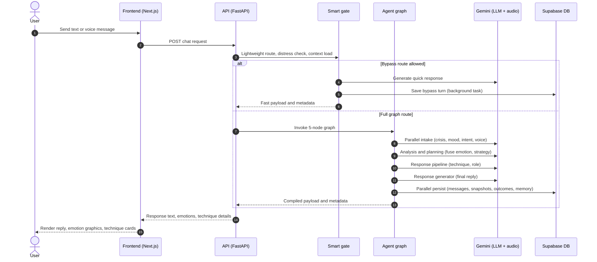

### Request Categories

- **Text chat** uses standard FastAPI routes and the agent graph.
- **Streaming chat** returns incremental output while keeping persistence intact.
- **Voice chat** transcribes audio first, then routes based on transcript meaning.
- **Dashboard requests** bypass the agent and read analytic aggregates from Supabase.
- **Crisis actions** use dedicated safety routes and Twilio-backed integrations.

---

## Pre-Graph Gate

The pre-graph gate is the most important routing layer. It runs before LangGraph and is shared by normal chat and streaming chat. It is a **staged dispatcher** that leverages parallel database loading and semantic LLM understanding to bypass or run the graph.

**Main modules**

- `agent/graph.py`
- `llm/llm_classifier.py`
- `utils/turn_lifecycle.py`
- `utils/turn_signals.py`
- `utils/distress_anchor.py`

```mermaid
flowchart TD
    classDef step fill:#EEF2FF,stroke:#6366F1,stroke-width:2px,color:#1E1B4B;
    classDef parallel fill:#FDF4FF,stroke:#D946EF,stroke-width:2px,color:#701A75;
    classDef decision fill:#FEF3C7,stroke:#D97706,stroke-width:2px,color:#78350F;
    classDef bypass fill:#F0F9FF,stroke:#0284C7,stroke-width:2px,color:#075985;
    classDef graph fill:#F0FDFA,stroke:#0D9488,stroke-width:2px,color:#115E59;

    Start["Latest user message"]:::step
    LoadHistory["Load recent message history"]:::step

    subgraph FetchParallel["Parallel context load"]
        UserFacts["User facts"]:::parallel
        SessionSumm["Session summaries"]:::parallel
        SessionFacts["Session facts and techniques"]:::parallel
    end

    GateLLM["Smart pipeline gate: LLM classifier"]:::step
    Normalize["Normalize route labels and flags"]:::step
    FollowupProtect["Contextual follow-up protection"]:::step
    TurnGuess["Initial turn-type guess"]:::step
    VoiceGuard{"Voice or audio data present?"}:::decision
    BypassAllowed{"Bypass confidence high enough?"}:::decision
    Bypass["Fast bypass response"]:::bypass
    FullGraph["Run 5-node agent graph"]:::graph

    Start --> LoadHistory --> FetchParallel --> GateLLM
    GateLLM --> Normalize --> FollowupProtect --> TurnGuess --> VoiceGuard
    VoiceGuard -- yes: force graph --> FullGraph
    VoiceGuard -- no --> BypassAllowed
    BypassAllowed -- yes --> Bypass
    BypassAllowed -- no --> FullGraph
```

### What The Pre-Gate Loads

- Latest user message and last few in-memory conversation turns.
- Database fallback message history when available.
- Stored user context, memory snippets, session summary, facts, and formatted session context.
- Latest recommended, pending, rejected, and active technique from session context.
- Previous assistant question and expected answer type.
- Prior exercise consent and solution preference.
- Voice metadata when a voice request already supplied it.

### What The Pre-Gate Checks

A deterministic safety net checks narrow, high-precision crisis language **before** the LLM router:

- Explicit intent to kill oneself, end one's life, or die.
- Statements of plan or immediate action.
- Means such as pills, knife, gun, rope, or blade with intent context.
- Recent or current self-harm.
- Passive suicidal ideation (e.g. not wanting to exist, wanting to disappear, "everyone better off without me").

The Gemini gate then classifies the latest message using recent conversation and stored context. Active route labels:

`chitchat` · `therapeutic` · `contextual_followup` · `technique_request` · `technique_follow_up` · `memory_query` · `crisis` · `positive_feedback`

The gate specifically checks whether:

- This is a crisis override before ordinary support.
- A short answer depends on the previous assistant question.
- The user is answering a duration, subject, trigger, or context question.
- Pronouns such as "it", "that", or "that exercise" refer to prior session context.
- The user says there are no more details (marks context complete).
- A technique was rejected or "didn't help".
- A short affirmation means technique acceptance vs. just answering a context question.
- "Thanks" is polite acknowledgement rather than outcome evidence.
- "No thanks" after a technique offer means declined exercise consent.
- The user reports a positive result after a technique.
- The user asks about prior memory, previous session content, or a technique name.
- This is a new emotional disclosure.
- The user explicitly asks for a coping exercise or technique.
- The message is casual small talk with no distress.
- The user corrects old context or suppresses a topic.

The gate also extracts structured preference fields:

|
 Field 
|
 Values 
|
|
---
|
---
|
|
`exercise_consent`
|
`unknown`
, 
`denied`
, 
`allowed`
|
|
`solution_preference`
|
`unknown`
, 
`listen_only`
, 
`advice_allowed`
, 
`exercise_requested`
|
|
`suppression_signal`
|
 whether the user corrected prior history 
|
|
`suppressed_topic`
|
 topic/person/source the user says not to use 
|
|
`active_issue_source`
|
 corrected active concern, when provided 
|

### Gate Normalization And Guardrails

After the LLM responds, the result is normalized and hardened:

- Old route labels are converted to current labels.
- `accept_technique` becomes `technique_follow_up` with an `accept_technique` flag.
- `rejection` becomes `technique_follow_up` with rejection flags.
- `list_techniques` becomes `technique_request` with a `list_techniques` flag.
- Unknown routes fall back to `therapeutic`.
- Positive outcome language forces `positive_feedback`.
- Negative exercise feedback forces `technique_follow_up`.
- Polite acknowledgement forces `chitchat` unless immediate technique-consent context exists.
- "No more details" forces `contextual_followup` and adds `context_complete`.
- Memory questions about old techniques get `technique_name_query`.
- Contextual follow-ups get lower intensity hints and mood-analysis skip flags.
- Chitchat and memory routes get near-zero intensity hints.
- Crisis gets high intensity and the full pipeline.

When the gate says `therapeutic` but the message is a short answer to the last assistant question inside an active distress thread, `_protect_contextual_followup_gate()` can correct it to `contextual_followup`. This protects the original distress anchor from being overwritten by low-signal follow-up text.

### Gate Bypass Routes

The bypass dispatcher in `_execute_gate_route()` can answer without running the full graph when the route is safe and voice emotion is not involved.

```mermaid
flowchart TD
    classDef step fill:#EEF2FF,stroke:#6366F1,stroke-width:2px,color:#1E1B4B;
    classDef decision fill:#FEF3C7,stroke:#D97706,stroke-width:2px,color:#78350F;
    classDef bypass fill:#F0F9FF,stroke:#0284C7,stroke-width:2px,color:#075985;
    classDef graph fill:#F0FDFA,stroke:#0D9488,stroke-width:2px,color:#115E59;
    classDef persist fill:#ECFDF5,stroke:#059669,stroke-width:2px,color:#065F46;

    GateResult["Gate result"]:::step
    ConsentBlock{"Prior refusal blocks technique?"}:::decision
    VoicePresent{"Audio or voice features present?"}:::decision
    Route{"Route"}:::decision
    Bypassed["Bypass handler: chitchat, memory, list, accept, reject, feedback, crisis"]:::bypass
    Full["Full graph: therapeutic route"]:::graph
    Persist["Background persist bypass turn"]:::persist

    GateResult --> ConsentBlock
    ConsentBlock -- yes: blocked --> Full
    ConsentBlock -- no --> VoicePresent
    VoicePresent -- yes: force graph --> Full
    VoicePresent -- no --> Route
    Route -- recognized bypass route --> Bypassed
    Route -- therapeutic or unresolved --> Full
    Bypassed --> Persist
```

Bypass routes include: `chitchat`, `memory_query`, `list_techniques`, `accept_technique`, `reject_technique`, `positive_feedback`, and `crisis` (direct safety pre-screener response). Bypass is **deliberately disabled for voice turns** — if audio or voice features exist, the system forces the full graph so voice preprocessing and emotion fusion are not dropped.

### Full Graph Input State

When bypass is not used, the gate builds the graph state with:

`messages` · `message` · `user_id` · `session_id` · `gate_route` · `gate_confidence` · `gate_context_flags` · `gate_emotional_register` · `gate_intensity_hint` · `gate_should_skip_mood_analysis` · `gate_needs_full_pipeline` · `prefetched_intent` · `prefetched_user_context` · `prefetched_session_context` · `turn_type_guess` · `previous_turn_context` · session message count · voice file path, voice features, transcription confidence, and voice feature snapshot when present

---

## Agent Graph

The agent is intentionally compact: **five graph nodes** with conditional routing between them. The heavy work happens inside specialized node modules, while the graph keeps orchestration readable.

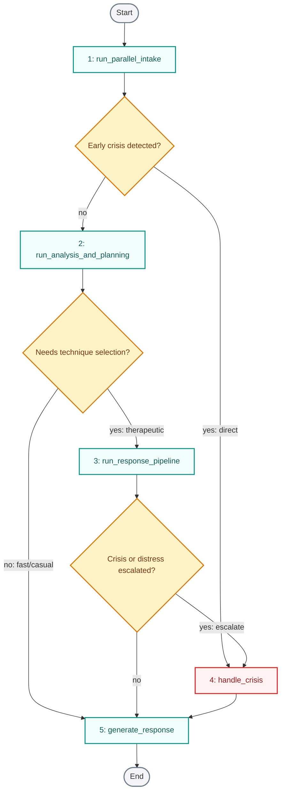

The graph has **no LangGraph checkpointer**. It uses `_message_store` for bounded in-memory message history and `_session_context_store` for compact session continuity. This reduces serialization overhead and keeps hot-path latency lower.

### Why This Shape Works

- Intake work runs early and in parallel.
- Crisis handling is reachable before *and* after deeper analysis.
- Simple turns can skip the expensive response pipeline.
- Complex emotional turns still receive full planning, memory, technique, and analytics support.
- Response generation is the single common exit, so assistant style stays consistent.

---

## Node Analysis

### 1. Parallel Intake

`nodes/parallel_intake.py`

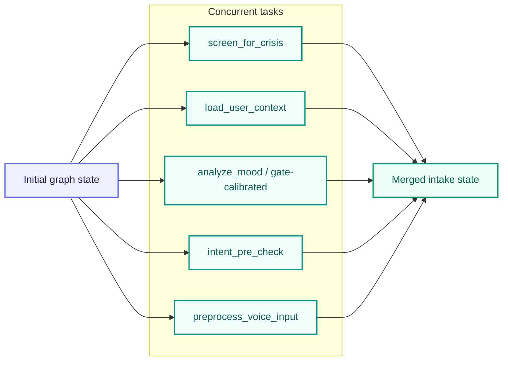

**Responsibilities**

- Skips duplicate crisis LLM when the smart gate already made a confident non-crisis route.
- Runs a backup crisis screen when the gate route is crisis, uncertain, or configured to duplicate crisis checks.
- Loads DB-backed user context, summaries, facts, memory, preferences, and chat history.
- Runs mood analysis unless the gate marks the turn as low-signal, contextual, memory, chitchat, positive feedback, technique follow-up, or voice-authoritative.
- Uses gate-calibrated mood for low-signal routes, and voice features as the authoritative mood source when Gemini audio features are present.
- Runs intent pre-check only when the smart gate did not already provide authoritative intent.
- Runs voice preprocessing only when audio exists and voice features aren't already processed.
- Preserves distress anchors so contextual replies don't lower or overwrite the true initial intensity.
- Emits emotion, sentiment, intensity, confidence, sub-emotions, symptoms, behaviors, contexts, crisis state, intent, memory context, and voice metadata.

**Collaborators:** `context_loader.py` · `intent_classifier.py` · `crisis_detection_node.py` · `memory_extraction_node.py` · `smart_gate_node.py`

---

### 2. Analysis And Planning

`nodes/analysis_and_planning.py`

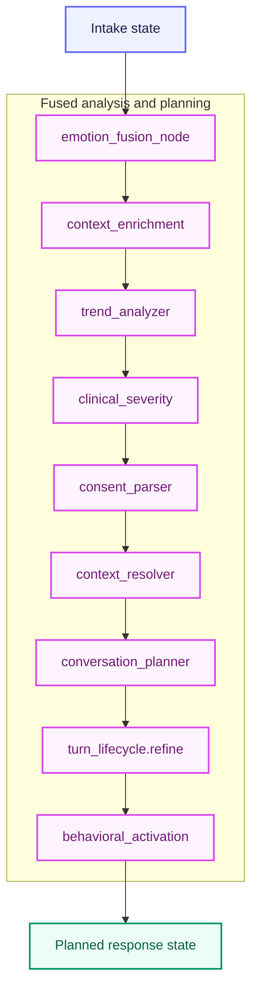

**Responsibilities**

- Fuses text and voice emotion into `fused_emotion` and `fused_intensity`.
- For therapeutic or crisis voice turns, passes authoritative Gemini audio emotion through with safety post-processing.
- For text-only turns, applies intensity normalization, neutral caps, hedge-word reduction, passive-ideation checks, gate caps, and distress-anchor guarding.
- Detects mismatch and possible masking between text and voice signals.
- Enriches exam, study, sleep, bedtime rumination, fear-of-failure, catastrophic thought, and environment-trigger context.
- Sets cognitive distortion hints (e.g. catastrophizing) when deterministic context supports it.
- Uses cached emotional trend or schedules trend refresh in the background.
- Sets clinical defaults to minimal unless optional heavier analysis is enabled.
- Parses consent, suppressed topics, corrected history, active issue source, and solution preference.
- Resolves short replies and pronouns against the last assistant question, active thread, active technique, and session context.
- Chooses the conversation strategy.
- Refines the lifecycle turn type from the gate's guess into a final `TurnType`.
- Optionally adds a behavioral activation micro-action when the feature flag allows it.

|
 Strategy outputs 
|
 Phase outputs 
|
|
---
|
---
|
|
`no_action`
 · 
`validate_only`
 · 
`ask_question`
 · 
`encourage_reflection`
 · 
`reframe`
 · 
`suggest_technique`
 · 
`distract`
|
`neutral`
 · 
`venting`
 · 
`reflection`
 · 
`solution`
 · 
`recovery`
|

---

### 3. Response Pipeline

`nodes/response_pipeline.py`

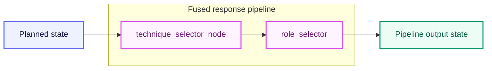

**Responsibilities**

- Checks `conversation_strategy` and `technique_readiness`.
- Honors exercise consent and listen-only preferences before selecting exercises.
- Preserves a pending recommended technique until the user consents.
- Anchors short consent turns to the real underlying distress emotion.
- Searches active DB techniques semantically against emotion, sub-emotion, symptoms, behaviors, contexts, concern, and intensity.
- Filters out unsuitable or suppressed techniques.
- Returns `recommended_technique`, `recommended_techniques_by_category`, `alternative_techniques`, `technique_candidates`, and `latest_recommended_technique`.
- Selects communication role from crisis state, fused intensity, trend, and phase.

**Role rules**

|
 Condition 
|
 Role 
|
|
---
|
---
|
|
 Crisis detected 
|
`crisis_support`
|
|
 Worsening trend, intensity at or above 0.6 
|
 can escalate to 
`trainer`
|
|
 Reflection phase 
|
 gentler — 
`coach`
 or 
`friend`
|
|
 Intensity below 0.4 
|
`friend`
|
|
 Intensity 0.4 up to 0.7 
|
`coach`
|
|
 Intensity 0.7 or above 
|
`trainer`
|

**Collaborators:** `utils/technique_selector.py` · `utils/role_selector.py`

---

### 4. Crisis Handler

`nodes/crisis_handler.py`

**Responsibilities**

- Produces crisis-safe response state.
- Avoids ordinary therapeutic technique framing during emergency-like turns.
- Connects crisis route metadata to API-level safety features and emergency alerts.
- Preserves auditability for crisis events.
- Enforces emergency contact verification and alert dispatch via SMS/WhatsApp.

**Collaborators:** `services/twilio_crisis.py` · `utils/distress_anchor.py`

---

### 5. Optimized Response Generator

`nodes/optimized_response_generator.py`

**Responsibilities**

- Creates the final assistant response.
- Respects route, phase, lifecycle, crisis, and voice-fusion guidance.
- Marks `technique_offered_this_turn` **only** when the final assistant message actually offers the selected technique.
- Avoids claiming the user feels differently when text and voice signals conflict.

---

## Lifecycle And Outcome Tracking

The lifecycle layer exists because mood analytics become noisy if every turn is treated as the same kind of emotional disclosure. A short "thanks" after a technique should not be scored like a new distress report, and a context-only answer should not distort mood-improvement graphs.

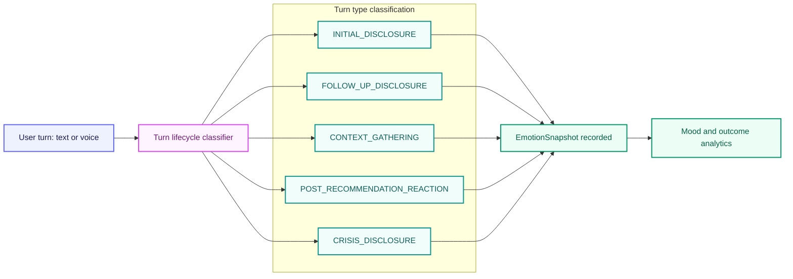

### Turn Type Meaning

|
 Turn type 
|
 Meaning 
|
|
---
|
---
|
|
`INITIAL_DISCLOSURE`
|
 First meaningful emotional disclosure in a session 
|
|
`FOLLOW_UP_DISCLOSURE`
|
 A later emotional update in the same session 
|
|
`CONTEXT_GATHERING`
|
 User is answering facts or logistics, no new mood signal 
|
|
`POST_RECOMMENDATION_REACTION`
|
 User is reacting after a technique or recommendation 
|
|
`CRISIS_DISCLOSURE`
|
 Turn contains crisis-level safety concerns 
|

### Outcome Flow


This supports cleaner questions such as:

- Did the user's intensity decrease after an actual technique offer?
- Was there enough follow-through evidence to score the technique?
- Is the dashboard comparing real disclosures instead of polite acknowledgements?
- Did the session peak improve by the final qualifying emotional snapshot?

---

## Voice And Emotion Fusion

Voice handling is **route-aware**. The system can transcribe audio and capture voice feature signals, but voice emotion is not forced into every route. The transcript drives routing first; voice features are linked into therapeutic or crisis processing when that route supports emotion fusion.

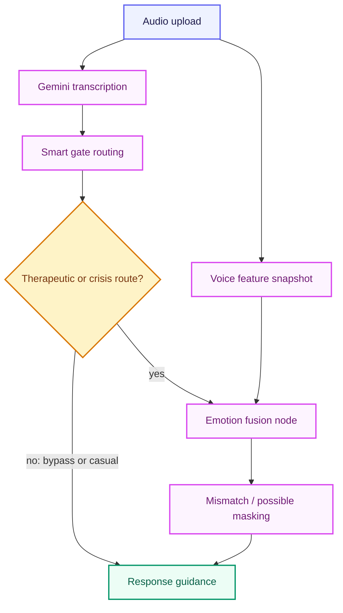

**Persisted fusion metadata** includes: text/voice mismatch, possible masking, fusion confidence, transcription confidence, voice feature snapshot, conversation phase, and response strategy.

The response prompt is instructed to acknowledge uncertainty carefully and **never assert that the user feels something different from what they said**.

---

## Crisis Safety

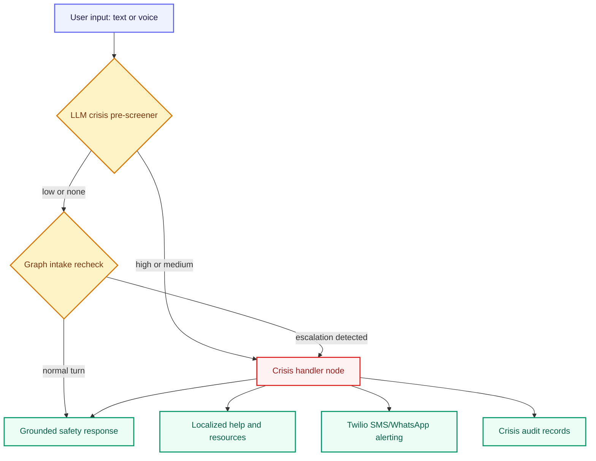

**Crisis features**

- Context-aware LLM-based crisis pre-screener in the pre-graph gate.
- Parallel intake validation check inside the graph as a redundant fail-safe.
- Dedicated crisis handler node managing distress peaks and emergency escalation.
- Stored emergency contact integration with automatic Twilio (SMS/WhatsApp) alerts.
- Secure crisis audit database logs for clinical compliance and dashboard tracking.
- Safety-first grounded response templates generated by the response node.

---

## Memory And Personalization

SentiMind uses several memory layers so the assistant remains continuous without treating every message as isolated.

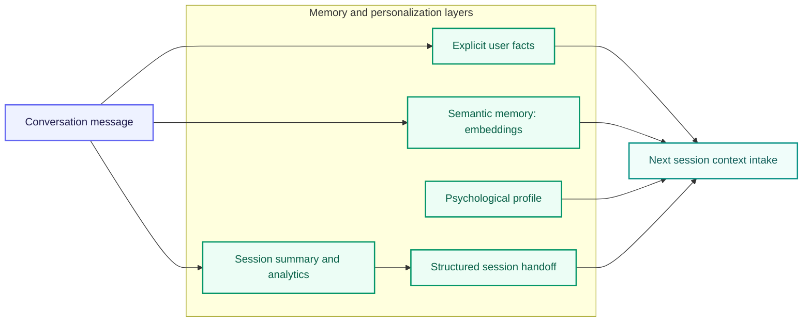

**Responsibilities**

- `memory/explicit_facts.py` extracts durable facts and stores them in the DB.
- `memory/semantic_memory.py` coordinates embedding-based search for past topic matches.
- `nodes/session_saver.py` updates dynamic user profile metadata, session summaries, and structured handoffs.
- The pre-graph loader in `agent/graph.py` injects relevant prior-session context into the smart gate.

---

## Dashboard Analytics

Dashboard analytics intentionally **ignore noisy turn types** when calculating improvement. This is where lifecycle tagging directly helps the product.

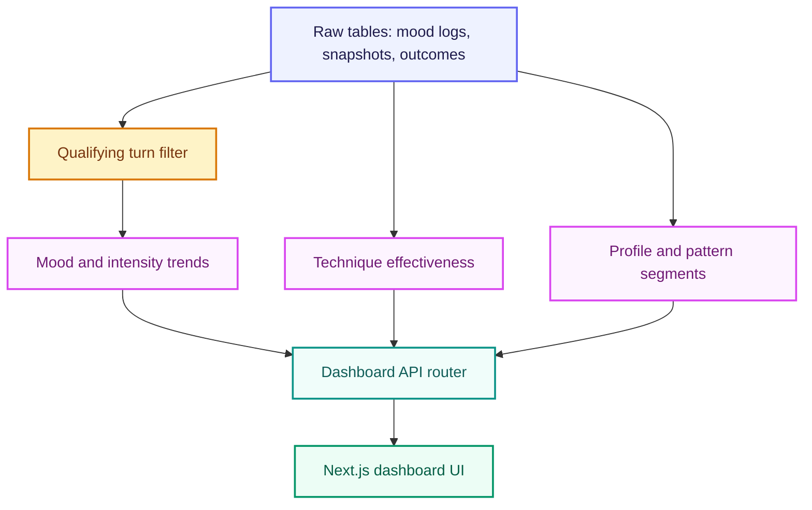

**Qualifying mood records**: `INITIAL_DISCLOSURE` · `FOLLOW_UP_DISCLOSURE` · `POST_RECOMMENDATION_REACTION` · `CRISIS_DISCLOSURE` · legacy `MoodLog` records

**Excluded from improvement-trend scoring**:

- `CONTEXT_GATHERING`
- Short acknowledgements without outcome evidence
- Assistant technique offers with no later user reaction

This makes the dashboard better at answering whether mood is increasing, decreasing, or stabilizing over time.

---

## Database Design

```mermaid
flowchart TB
    classDef user fill:#FFF1F2,stroke:#F43F5E,stroke-width:2px,color:#881337;
    classDef convo fill:#EEF2FF,stroke:#6366F1,stroke-width:2px,color:#1E1B4B;
    classDef wellness fill:#FDF4FF,stroke:#D946EF,stroke-width:2px,color:#701A75;
    classDef memory fill:#F0FDFA,stroke:#0D9488,stroke-width:2px,color:#115E59;
    classDef safety fill:#FEF2F2,stroke:#DC2626,stroke-width:2px,color:#991B1B;

    User["User entity"]:::user

    subgraph Conversation["Conversation domain"]
        Session["Session: active/peak tracking"]:::convo
        Message["Message: conversational history"]:::convo
        EmotionSnapshot["EmotionSnapshot: turn-level fused emotion"]:::convo
        SessionSummary["SessionSummary: final summary, handoff"]:::convo
    end

    subgraph Wellness["Wellness and technique domain"]
        MoodLog["MoodLog: self-reports"]:::wellness
        TechniqueOutcome["TechniqueOutcome: pending/resolved"]:::wellness
        UserTechniquePreference["UserTechniquePreference: consent"]:::wellness
        PsychProfile["PsychProfile: trait tracking"]:::wellness
    end

    subgraph MemoryDomain["Memory domain"]
        UserMemory["UserMemory: long-term profile"]:::memory
        SemanticMemory["SemanticMemory: embeddings"]:::memory
        ExplicitFact["ExplicitFact: extracted facts"]:::memory
    end

    subgraph SafetyDomain["Safety and audit domain"]
        CrisisEvent["CrisisEvent: trigger logs"]:::safety
        CrisisResource["CrisisResource: help desks"]:::safety
        TrustedContact["TrustedContact: emergency verification"]:::safety
        AuditLog["AuditLog: admin/usage audits"]:::safety
    end

    User --> Session
    Session --> Message & EmotionSnapshot & SessionSummary
    User --> MoodLog & TechniqueOutcome & UserTechniquePreference & PsychProfile
    User --> UserMemory & SemanticMemory & ExplicitFact
    User --> CrisisEvent & TrustedContact & AuditLog
    CrisisEvent --> CrisisResource
```

**Important schema areas**

|
 Table 
|
 Purpose 
|
|
---
|
---
|
|
`Session`
|
 Session state, mood summary, peak intensity tracking 
|
|
`Message`
|
 User and assistant messages plus technique-offer flags 
|
|
`EmotionSnapshot`
|
 Emotion, intensity, lifecycle type, fusion metadata, technique linkage 
|
|
`TechniqueOutcome`
|
 Pending and resolved intervention outcomes 
|
|
`SessionSummary`
|
 Final emotion, final intensity, turn-type counts, handoff data 
|
|
`MoodLog`
|
 Explicit mood logging and legacy trend support 
|
|
 Memory tables 
|
 User facts, semantic memories, profile signals 
|
|
 Crisis/audit tables 
|
 Safety and compliance-oriented records 
|

---

## API Surface

### Chat And Pipeline


|
 Method 
|
 Route 
|
 Handler 
|
|
---
|
---
|
---
|
|
 GET 
|
`/`
|
`root`
|
|
 GET 
|
`/health`
|
`health_check`
|
|
 POST 
|
`/api/chat`
|
`chat`
|
|
 POST 
|
`/api/chat/stream`
|
`chat_stream`
|
|
 POST 
|
`/api/chat/voice`
|
`chat_voice`
|
|
 POST 
|
`/api/pipeline/complete`
|
`pipeline_complete`
|

### Authentication And User Bootstrap

|
 Method 
|
 Route 
|
 Handler 
|
|
---
|
---
|
---
|
|
 POST 
|
`/api/user/create`
|
`create_user`
|
|
 POST 
|
`/api/auth/signup`
|
`auth_signup`
|
|
 POST 
|
`/api/auth/login`
|
`auth_login`
|
|
 POST 
|
`/api/user/ensure`
|
`ensure_user`
|

### Sessions

|
 Method 
|
 Route 
|
 Handler 
|
|
---
|
---
|
---
|
|
 GET 
|
`/api/user/{user_id}/sessions`
|
`get_user_sessions`
|
|
 GET 
|
`/api/session/{session_id}/messages`
|
`get_session_messages`
|
|
 PATCH 
|
`/api/session/{session_id}/rename`
|
`rename_session`
|
|
 DELETE 
|
`/api/session/{session_id}`
|
`delete_session`
|
|
 POST 
|
`/api/session/new`
|
`create_new_chat_session`
|

### Dashboard And Profile

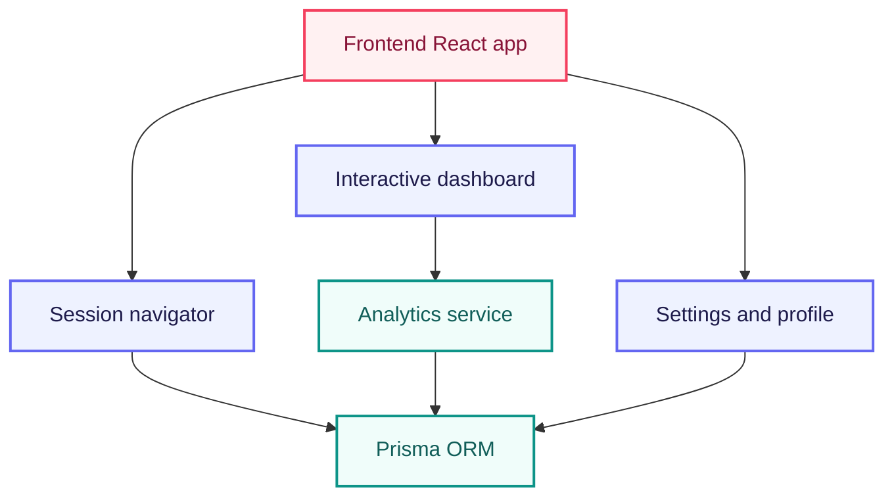

|
 Method 
|
 Route 
|
 Handler 
|
|
---
|
---
|
---
|
|
 GET 
|
`/api/dashboard/user/{user_id}`
|
 mounted dashboard router 
`get_user_dashboard`
, also compatibility handler 
`dashboard_user_direct`
|
|
 GET 
|
`/dashboard/user/{user_id}`
|
`dashboard_user_direct_no_api_prefix`
|
|
 GET 
|
`/api/dashboard/health`
|
`dashboard_health`
|
|
 GET 
|
`/api/dashboard/stats`
|
`get_dashboard_stats`
|
|
 GET 
|
`/api/user/{user_id}/stats`
|
`get_user_stats_legacy`
|
|
 GET 
|
`/api/user/{user_id}/profile`
|
`get_user_profile`
|

### Settings, Onboarding, Consent, Data Rights

|
 Method 
|
 Route 
|
 Handler 
|
|
---
|
---
|
---
|
|
 POST 
|
`/api/user/settings`
|
`save_user_settings`
|
|
 POST 
|
`/api/user/onboarding`
|
`save_onboarding`
|
|
 DELETE 
|
`/api/user/{user_id}`
|
`delete_user_account`
|
|
 POST 
|
`/api/user/{user_id}/consent`
|
`record_consent`
|
|
 POST 
|
`/api/user/{user_id}/consent/withdraw`
|
`withdraw_consent`
|
|
 GET 
|
`/api/user/{user_id}/data-export`
|
`export_user_data`
|
|
 DELETE 
|
`/api/user/{user_id}/data`
|
`delete_user_data`
|

### Techniques And Wellness

|
 Method 
|
 Route 
|
 Handler 
|
|
---
|
---
|
---
|
|
 GET 
|
`/api/wellness/tips`
|
`get_wellness_tips`
|
|
 GET 
|
`/api/techniques`
|
`get_techniques`
|
|
 POST 
|
`/api/technique/rate`
|
`rate_technique`
|

### Crisis Router (`/api/crisis`)

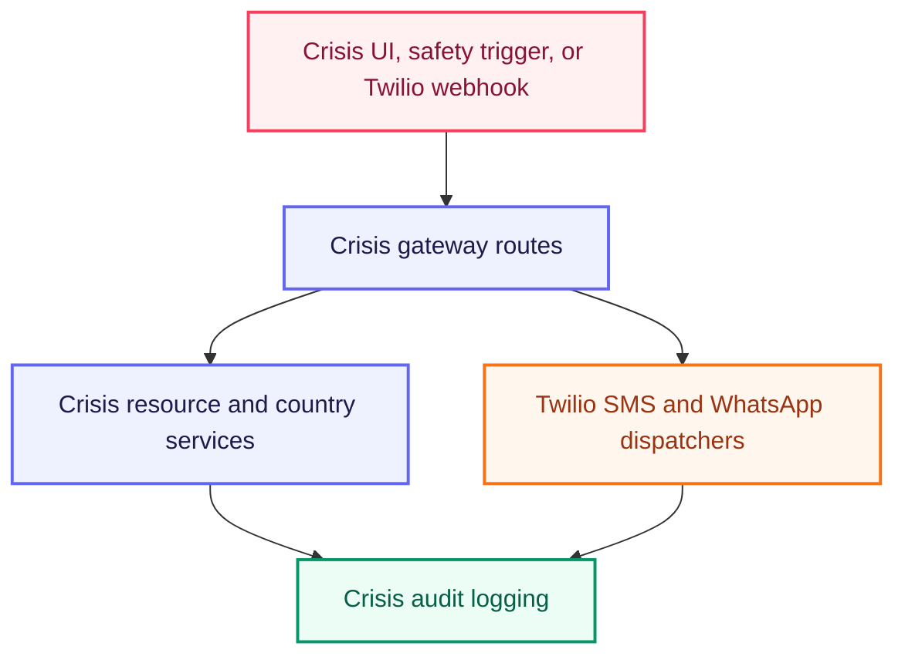

|
 Method 
|
 Route 
|
 Handler 
|
|
---
|
---
|
---
|
|
 POST 
|
`/api/crisis/resources`
|
`get_resources`
|
|
 POST 
|
`/api/crisis/detect-country`
|
`detect_country`
|
|
 POST 
|
`/api/crisis/initiate-call`
|
`initiate_crisis_call`
|
|
 POST 
|
`/api/crisis/send-sms`
|
`send_crisis_sms`
|
|
 GET 
|
`/api/crisis/call-status/{call_sid}`
|
`get_call_status`
|
|
 GET 
|
`/api/crisis/health`
|
`crisis_health`
|
|
 POST 
|
`/api/crisis/pakistan/alert`
|
`alert_pakistan_crisis_center`
|
|
 POST 
|
`/api/crisis/pakistan/whatsapp-alert`
|
`alert_pakistan_whatsapp`
|
|
 POST 
|
`/api/crisis/twilio/response`
|
`handle_twilio_response`
|
|
 POST 
|
`/api/crisis/twilio/status`
|
`handle_twilio_status`
|
|
 POST 
|
`/api/crisis/test-whatsapp-alert`
|
`test_whatsapp_alert`
|
|
 POST 
|
`/api/crisis/send-location`
|
`send_location_alert`
|
|
 POST 
|
`/api/crisis/send-location-auto`
|
`send_location_auto`
|

### Active Frontend API Calls

The frontend API base is `NEXT_PUBLIC_API_URL`, defaulting to `http://localhost:8000/api`.

**Auth**

- NextAuth credentials provider calls `POST /api/auth/signup` and `POST /api/auth/login`.
- Auth server action calls `POST /api/user/ensure`.

**Chat**

- Streaming chat calls `POST /api/chat/stream`.
- Browser crisis GPS helper calls `POST /api/crisis/send-location`.
- Session actions call the session list, message list, rename, and delete routes.

**Profile and onboarding**

- Profile action calls `GET /api/user/{user_id}/profile`, `POST /api/user/settings`, `GET /api/user/{user_id}/data-export`, `POST /api/user/{user_id}/consent/withdraw`, and (legacy) `DELETE /api/user/{user_id}`.
- Onboarding action calls `POST /api/user/onboarding`.

> **Known route mismatch:** `frontend/src/actions/profile.ts` references `POST /api/user/erasure-request`, but no matching FastAPI route is currently registered. The current backend data-deletion route is `DELETE /api/user/{user_id}/data`.

---

## Frontend Architecture

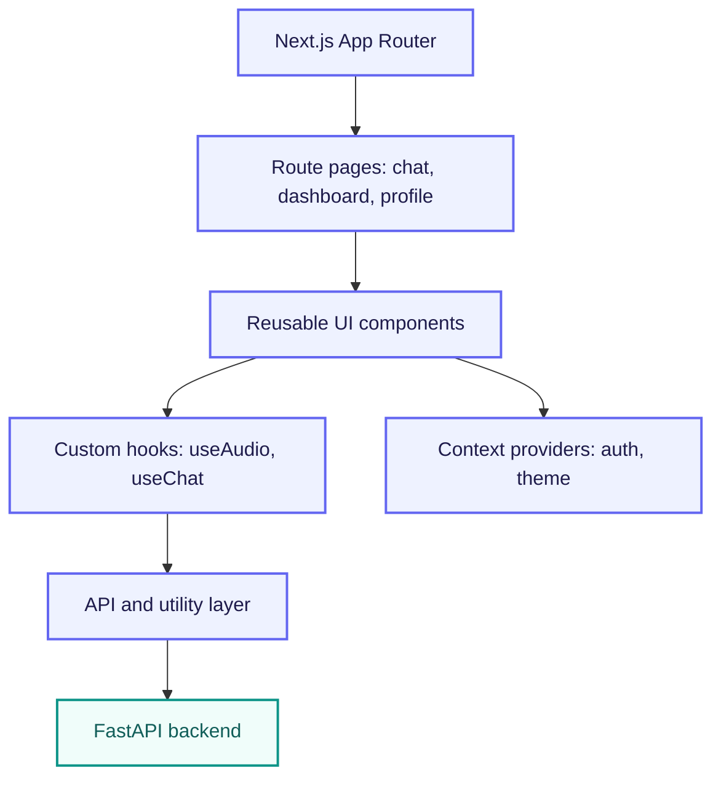

### Pages

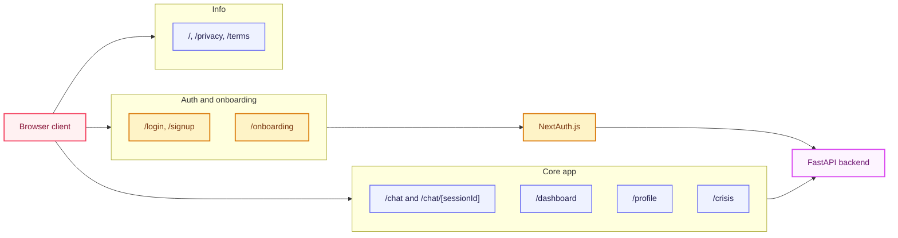

**Responsibilities**: chat interface, streaming response rendering, voice upload/recording UI, dashboard visualization, profile and onboarding screens, authentication screens, protected route behavior, crisis support surfaces, API client integration.

**Important folders**: `frontend/src/app` · `frontend/src/components` · `frontend/src/hooks` · `frontend/src/lib` · `frontend/src/contexts` · `frontend/src/types`

---

## Repository Structure

```text
E:\FYP
  frontend\
    src\
      app\
      components\
      hooks\
      lib\
      contexts\
      types\
    package.json

  mental_health_wellness\
    api_server.py
    prisma\
      schema.prisma
    src\mental_health_wellness\
      agent\
      api\
      nodes\
      services\
      utils\
    tests\

  README.md
```

Root README is the main project documentation. Duplicate README files were consolidated so this file stays the single source of truth.

---

## Environment Variables

**Backend**

`DATABASE_URL` · `DIRECT_URL` · `GEMINI_API_KEY` · `GOOGLE_API_KEY` · `TWILIO_ACCOUNT_SID` · `TWILIO_AUTH_TOKEN` · `TWILIO_PHONE_NUMBER` · `ENVIRONMENT` · `LOG_LEVEL` · `FRONTEND_URL`

**Frontend**

`NEXT_PUBLIC_API_BASE_URL` · `NEXT_PUBLIC_SUPABASE_URL` · `NEXT_PUBLIC_SUPABASE_ANON_KEY`

> Keep secrets out of source control. Use local `.env` files or your deployment provider's secret store.

---

## Setup

**Backend**

```powershell
cd E:\FYP\mental_health_wellness
python -m venv .venv
.\.venv\Scripts\Activate.ps1
pip install -r requirements.txt
python -m prisma generate
```

**Frontend**

```powershell
cd E:\FYP\frontend
npm install
```

---

## Running The Project

**Backend** — default URL `http://localhost:8000`

```powershell
cd E:\FYP\mental_health_wellness
python -m api_server
```

**Frontend** — default URL `http://localhost:3000`

```powershell
cd E:\FYP\frontend
npm run dev
```

---

## Validation

**Focused backend checks**

```powershell
cd E:\FYP
python -m py_compile mental_health_wellness\src\mental_health_wellness\agent\graph.py
python -m py_compile mental_health_wellness\src\mental_health_wellness\nodes\optimized_response_generator.py
pytest -q mental_health_wellness\tests
```

**Focused lifecycle and voice checks**

```powershell
cd E:\FYP
pytest -q mental_health_wellness\tests\test_lifecycle_outcome_layer.py
pytest -q mental_health_wellness\tests\test_voice_authoritative.py
pytest -q mental_health_wellness\tests\test_context_complete_technique_gate.py
pytest -q mental_health_wellness\tests\test_short_acknowledgement_context.py
```

**Frontend checks**

```powershell
cd E:\FYP\frontend
npm run lint
npm run build
```

**Manual smoke test**

1. Start backend and frontend.
2. Send an initial emotional disclosure → confirm `INITIAL_DISCLOSURE` is stored.
3. Continue with a follow-up emotional update → confirm `FOLLOW_UP_DISCLOSURE` is stored.
4. Provide enough context for a technique offer → confirm the assistant message has `techniqueOfferedThisTurn`.
5. Reply with a real reaction after trying it → confirm the pending `TechniqueOutcome` resolves.
6. Open the dashboard → verify the mood trend excludes context-only turns.

---

## Operational Notes

- Do not run multiple backend servers on port `8000`.
- If Prisma reports a query-engine mismatch, regenerate with `python -m prisma generate`.
- If Supabase schema changes are made manually, keep `schema.prisma` synchronized.
- Additive enum migrations can leave legacy enum values in PostgreSQL; app normalization handles the known old `POST_RECOMMENDATION` value.
- Runtime logs and generated reports should not be treated as source documentation.
- The real Python test suite under `mental_health_wellness/tests` should be kept.

---

## Credits

<div align="center">

**Developer:** Taha Mehmood
**Co-Developer:** Hasnain Gul

</div>
